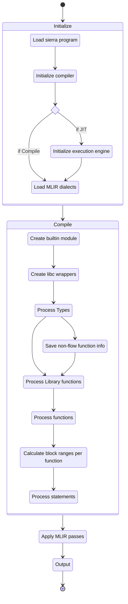
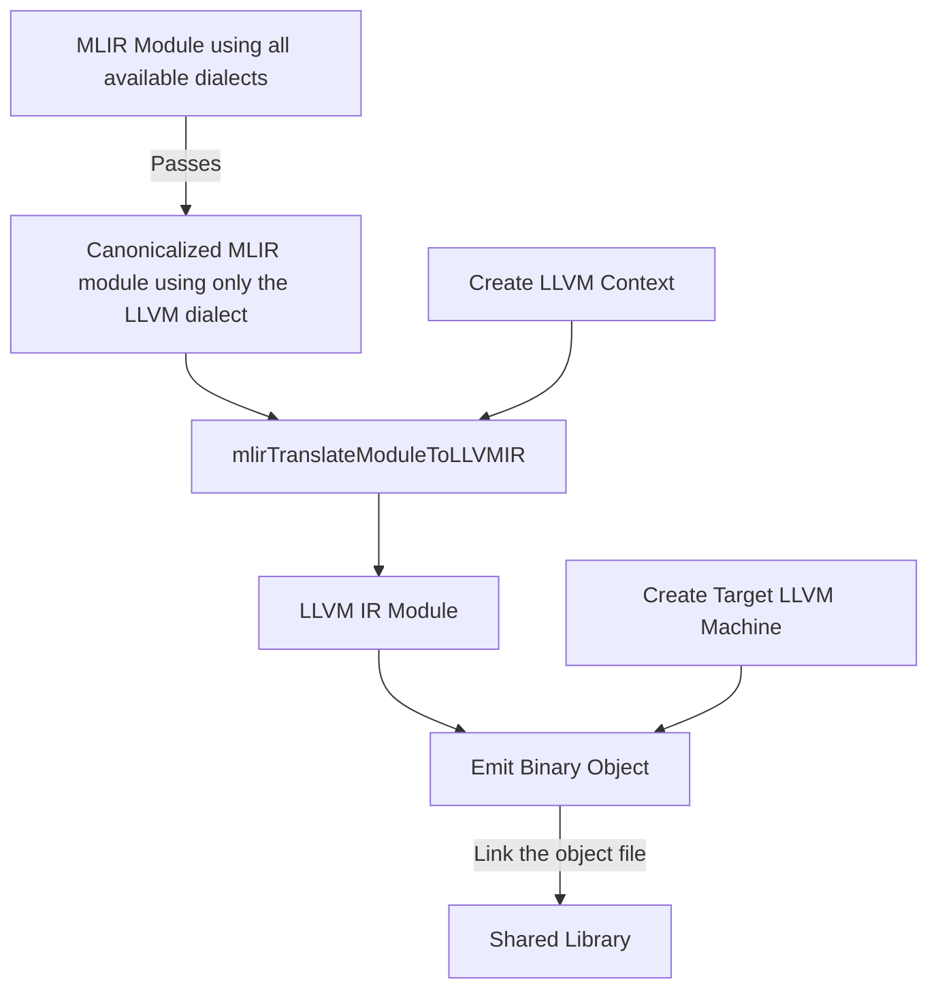
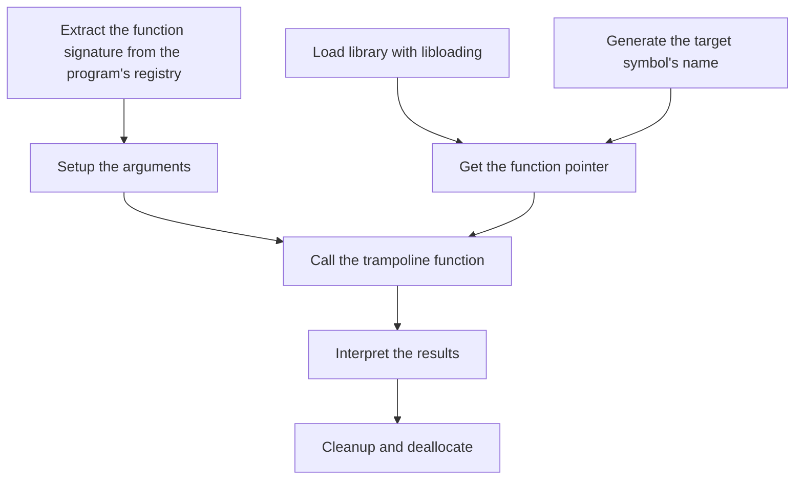

# Compilation Walkthrough
This section describes the entire process Cairo Native goes through to
compile a Cairo program to either a shared library (and how to use it) or a
MLIR module for use in the JIT engine.

## General flow
If you check `lib.rs` you will see the high level modules of the project.

The compiler module is what glues together everything.
You should read its module level documentation.
But the basic flow is like this:
- We take a sierra `Program` and iterate over its functions.
- On each function, we create a MLIR region and a block for each statement
  (a.k.a library function call), taking into account possible branches.
- On each statement we call the library function implementation, which
  appends MLIR code to the given block, and with helper methods, it handles
  possible branches and input/output variables.



## Loading a Cairo Program
The first step is to get the sierra code from the given cairo program, this
is done using the relevant methods from the `cairo_lang_compiler` crate.

This gives us a `cairo_lang_sierra::program::Program` which has the following
structure:

```rust,ignore
pub struct Program {
    pub type_declarations: Vec<TypeDeclaration, Global>,
    pub libfunc_declarations: Vec<LibfuncDeclaration, Global>,
    pub statements: Vec<GenStatement<StatementIdx>, Global>,
    pub funcs: Vec<GenFunction<StatementIdx>, Global>,
}
```

The compilation process consists in parsing these fields to produce the
relevant MLIR IR code.

To do all this we will need a MLIR Context and a module created with that
context, the module describes a compilation unit, in this case, the cairo
program.

## Initialization

In Cairo Native we provide a API around initializing the context, namely
`NativeContext` which does the following when
[created](https://github.com/lambdaclass/cairo_native/blob/ca6549a68c1b4266a7f9ea41dc196bf4433a2ee8/src/context.rs#L52-L53):

- Create the context
- Register all relevant MLIR dialects into the context
- Load the dialects
- Register all passes into the context
- Register all translations to LLVM IR into the context.

<aside>
💡 Registering doesn’t mean using, it means that later in the compilation
process we will use these registered features, such as the translations to
LLVM IR to create a shared library.
</aside>

## Compiling a Sierra Program to MLIR

The `NativeContext` has a method called
[compile](https://github.com/lambdaclass/cairo_native/blob/ca6549a68c1b4266a7f9ea41dc196bf4433a2ee8/src/context.rs#L62-L63),
which does the heavy lifting and returns a `NativeModule`.
This module contains the generated MLIR IR code.

The compile method does the following:
- Create a Module
- Create the Metadata storage (check the relevant section for more information).
- Check if the Sierra program has a gas builtin in it, if it has it will
  insert the gas metadata into the storage.
- Create the Sierra program registry, which allows type and function lookups.
- Call a internal `compile` method.

This internal `compile` method then loops on the program function
declarations calling the `compile_func` method on each of them.

### Compiling a function (`compile_func`)

This method generates the structure of the function in MLIR, meaning it will
create the region the body of the function will live on, and then a block
for each statement, each with it’s relevant arguments and return values. It
will also check each statement whether it is branching, and store the
predecessors of each block, to handle jumps.

While handling each statement on the function, it will build the types it
finds from the arguments and return values as it encounters them, this is
done using the trait `TypeBuilder`.

After having the function structure created, we proceed to creating the
initial state, which is a Hash map holding the local variables we currently
have, the parameters.

Using this initial state, it builds the entry block, which is the first
block the function enters when it’s called, it has the function arguments
as parameters.

Then it loops on the statements of the function, on each statement it does
the following:

- Check if there is a gas metadata, and if the statement has a gas cost,
  insert the gas cost metadata that lives on only during this statement.
- Get the block and possible landing block of this statement.
- If there is a landing block, create it. A landing block is the target
  block of a previous jump that simply forwards to the current block.

## Metadata Storage
This storage is shared everywhere in the compilation process and allows to
easily share data to the relevant places, for example the Gas Metadata
allows getting the gas cost for a given statement, or the enum snapshot
metadata to get the relevant variants in the libfunc builder.

# Compiling to native code

We part from the point where the program has been compiled into MLIR IR,
and we hold the MLIR Context and Module.

From this point, we convert all the dialects within this IR into the LLVM
MLIR Dialect, which is a needed precondition to transform the MLIR IR into
LLVM IR. This is done through passes which are the basis of how LLVM works.

<aside>
ℹ️ This translation does canonicalization, so some optimizations are done.
</aside>

Given a MLIR Module with only the LLVM dialect, we can translate it,
currently the LLVM MLIR API for this is only available in C++, so we had
to make our temporary C API wrapper (which we contributed to upstream LLVM,
coming soon to LLVM 18 maybe). After that we also need to use the `llvm-sys`
crate which provides the C API bindings in Rust.

The required method is `mlirTranslateModuleToLLVMIR` which takes a MLIR
Module and a LLVM Context (not a MLIR one!). The LLVM Context will be used
to create a LLVM Module, which we can then compile to machine code.

The process is a bit verbose but interesting, LLVM itself is a target
independent code generator, but to compile down we need an actual target,
to do so we initialize the required target and utilities (in this case we
initialize all targets the current compiled LLVM supports):

```rust,ignore
LLVM_InitializeAllTargets();
LLVM_InitializeAllTargetInfos();
LLVM_InitializeAllTargetMCs();
LLVM_InitializeAllAsmPrinters();
LLVM_InitializeAllAsmParsers();
```

After that we create a LLVM context, and pass it along the module to the
`mlirTranslateModuleToLLVMIR` method:

```rust ,ignore
let llvm_module = mlirTranslateModuleToLLVMIR(mlir_module_op, llvm_context);
```

Then we need to create the target machine, which needs a target triple, the
CPU name and CPU features. After creating the target machine, we can emit
the object file either to a memory buffer or a file.

```rust,ignore
let machine = LLVMCreateTargetMachine(
            target,
            target_triple.cast(),
            target_cpu.cast(),
            target_cpu_features.cast(),
            LLVMCodeGenOptLevel::LLVMCodeGenLevelNone, // opt level
            LLVMRelocMode::LLVMRelocDynamicNoPic,
            LLVMCodeModel::LLVMCodeModelDefault,
);

let mut out_buf: MaybeUninit<LLVMMemoryBufferRef> = MaybeUninit::uninit();

LLVMTargetMachineEmitToMemoryBuffer(
            machine,
            llvm_module,
            LLVMCodeGenFileType::LLVMObjectFile,
            error_buffer,
            out_buf.as_mut_ptr(),
);
```

After emitting the object file, we need to pass it to a linker to get our
shared library. This is currently done by executing `ld`, with the proper
flags to create a shared library on each platform, as a process using a
temporary file, because it can’t be piped.



## Loading the native library and using it
To load the library, we use the crate `libloading`, passing it the path to
our shared library.

Then we initialize the `AotNativeExecutor` with the loaded library and the
program registry.

This initialization internally does the following:
- Constructs the symbol of the function to be called, which is always the
  function name but wrapped with a prefix to instead target the C API
  wrapper, it looks like the following:

```rust,ignore
let function_name = format!("_mlir_ciface_{function_name}");
```

- Using the registry we get the function signature, although `libloading`
  allows us to have a function signature at compile time to make sure we
  call it properly, but we need to ignore this as we want to call any
  function given the library and the registry.

<aside>
🚧 TODO: Explain how we call the function here, the custom assembly trampoline, etc
</aside>



## Addendum

### About canonicalization in MLIR:
MLIR has a single canonicalization pass, which iteratively applies the
canonicalization patterns of all loaded dialects in a greedy way.
Canonicalization is best-effort and not guaranteed to bring the entire IR in
a canonical form. It applies patterns until either fix point is reached or
the maximum number of iterations/rewrites (as specified via pass options) is
exhausted. This is for efficiency reasons and to ensure that faulty patterns
cannot cause infinite looping.

Good read about this: [https://sunfishcode.github.io/blog/2018/10/22/Canonicalization.html](https://sunfishcode.github.io/blog/2018/10/22/Canonicalization.html)
