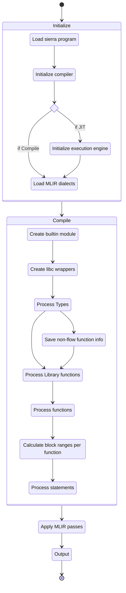
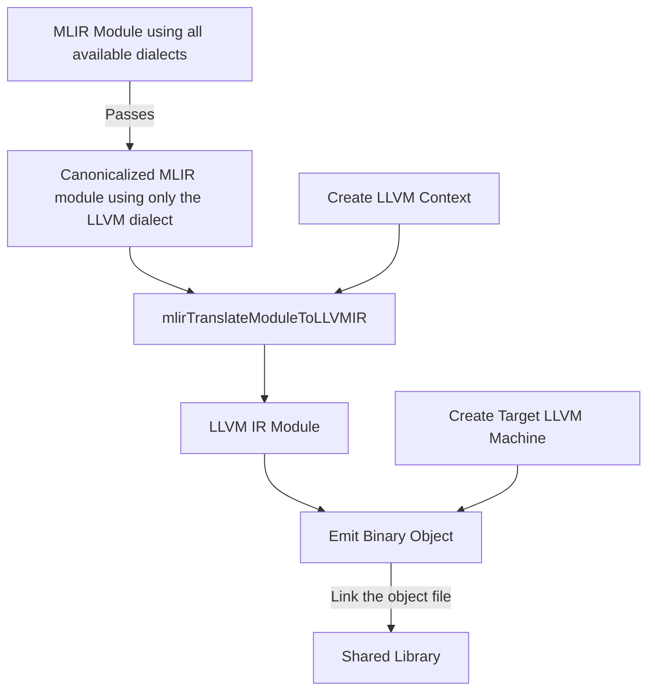
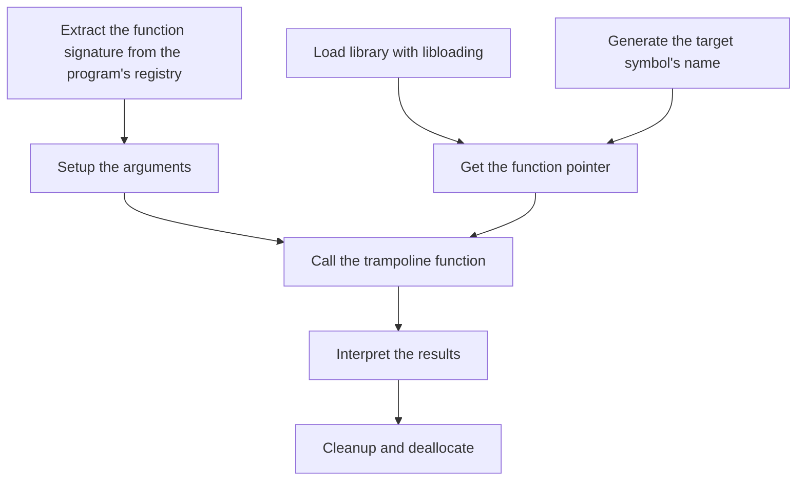

# Compilation walkthrough

This section describes the entire process Cairo Native goes through to compile a
Sierra program to either a shared library (and how to use it) or a MLIR module
for use in the JIT engine.

## General flow

If you check `lib.rs` you will see the high level modules of the project.

The compiler module is what glues together everything. You should read its
module level documentation, but the basic flow goes like this:

1. We take a Sierra `Program` and iterate over its functions.
2. For each function, we create a MLIR region which has a block for each
   statement (a.k.a libfunc invocation), taking into account possible branches.
3. For each statement we generate the libfunc implementation in their respective
   block. The block is terminated by the branch operation generated by the
   libfunc helper, which has enough information to handle branching properly.



## Loading a Cairo Program

The first step is to get the Sierra code from the given cairo program, this is
done using the relevant methods from the `cairo_lang_compiler` crate.

This gives us a `cairo_lang_sierra::program::Program` which has the following
structure:

```rust,ignore
pub struct Program {
    pub type_declarations: Vec<TypeDeclaration, Global>,
    pub libfunc_declarations: Vec<LibfuncDeclaration, Global>,
    pub statements: Vec<GenStatement<StatementIdx>, Global>,
    pub funcs: Vec<GenFunction<StatementIdx>, Global>,
}
```

The compilation process uses these fields through the `ProgramRegistry` to
generate the relevant MLIR IR code.

To do all this we will need a MLIR context and a MLIR module created it. The 
module describes a compilation unit, in this case, the Cairo
program.

## Initialization

In Cairo Native we provide an API around context initialization, namely
`NativeContext` which does the following when
[created](https://github.com/lambdaclass/cairo_native/blob/main/src/context.rs#L56-L59):

1. Create the context.
2. Register all relevant MLIR dialects into the context.
3. Load the dialects.
4. Register all passes into the context.
5. Register all translations (e.g. to LLVM IR) into the context.

<aside>
💡 Registering doesn’t mean using, it means that later in the compilation
process we will use these registered features, such as the translations to LLVM
IR to create a JIT engine or shared library.
</aside>

## Compiling a Sierra Program to MLIR

The `NativeContext` has a method called
[compile](https://github.com/lambdaclass/cairo_native/blob/main/src/context.rs#L70-L233),
which does the heavy lifting and returns a `NativeModule`. That module contains
the generated MLIR IR code.

The compile method does the following:

1. Create the MLIR module.
2. Create the metadata storage (check relevant sections for more info).
3. Check if the Sierra program uses the gas builtin. If it does, it will insert
   the gas metadata into the metadata storage.
4. Create the Sierra program registry, which allows for easy type, libfunc and
   function lookups.
5. Call the internal `compile` method.

This internal `compile` method then loops on the program function declarations,
calling the `compile_func` method on each of them.

### Compiling a function (`compile_func`)

This method first generates the structure of the function in MLIR, meaning it
will create the region the body of the function will live on, and then a block
for each statement, each with it’s relevant arguments and return values. It will
also check each statement whether it is branching, and store the predecessors of
each block. The predecessors are used to create the auxiliary landing blocks.

After finishing the function structure, we need to generate the initial state,
which is a hash map holding the data we currently have, that is, the function
arguments.

Starting from this initial state, the compiler walks the entire tree of
statements in a depth-first manner, generating the implementation for all the
invocations in order. While this happens, the state is updated accordingly (the
invocation arguments are removed while the results are inserted).

Then it loops on the statements of the function, on each statement it does
the following:

- Check if there the gas metadata is present and whether the current statement
  has a cost, then insert the `GasCost` metadata if it exists. This metadata
  will be removed before the next statement is processed.
- Get the block and potential landing block for this statement.
- Build the statement. This step may require extra blocks, which will be
  inserted immediately after the first one.

While handling each statement on the function, the libfunc code generators may
build the types they need (ex. arguments and return values) using the
`TypeBuilder` trait.

## Metadata Storage

This storage is passed around within the compilation process and allows to
easily share data that would otherwise be difficult to implement if the need was
not known beforehand. Some examples are the gas metadata, which provides the gas
cost for any given statement, or the drop and dup overrides, that contain the
specializations for the `drop` and `dup` libfuncs for respectively.

# Compiling to native code

At this point, the Sierra program has already been transpiled into MLIR and is
currently stored within the module.

The MLIR code is exactly as we've generated it, which means it'll use any
dialect we've found to be useful for transpiling the code. This isn't ideal as
we need everything to be in the LLVM dialect, which is what can be translated
into LLVM IR. This conversion is performed through passes which are the building
blocks of MLIR and LLVM optimizations.

<aside>
ℹ️ This dialect conversion includes a canonicalization pass. This pass will
remove redundant or unnecessary blocks, extract constants, and try to normalize
the program's form. This counts as a kind of optimization.
</aside>

Since we now have the entire program transpiled using only the LLVM dialect, we
can proceed to translate it to LLVM IR. The APIs to do that weren't available
for C when we started, so we contributed them to upstream LLVM. This also meant
we've had to use the `llvm-sys` crate directly, which contains the raw LLVM C
bindings.

The function we need to translate MLIR to LLVM IR is called
`mlirTranslateModuleToLLVMIR`. It takes the MLIR module and an LLVM context,
which will be the one associated with the LLVM IR module. The resulting module
can then be fed to LLVM to be compiled into machine code.

The process is a bit verbose but interesting nontheless. LLVM itself is a target
independent code generator, but to compile the module down to machine code we
need an actual target. The targets and all their dependencies can be initialized
by calling the following functions:

```rust,ignore
LLVM_InitializeAllTargets();
LLVM_InitializeAllTargetInfos();
LLVM_InitializeAllTargetMCs();
LLVM_InitializeAllAsmPrinters();
LLVM_InitializeAllAsmParsers();
```

Once everything's been initialized, we can create the LLVM context and use it
to translate the MLIR module into LLVM IR:

```rust ,ignore
let llvm_module = mlirTranslateModuleToLLVMIR(mlir_module_op, llvm_context);
```

The target we're compiling for is defined by the target triple, which contains
the CPU architecture, the vendor and the operating system. We can also specify
which features our CPU supports to allow LLVM to generate more optimized machine
code.

```rust,ignore
let machine = LLVMCreateTargetMachine(
    target,
    target_triple.cast(),
    target_cpu.cast(),
    target_cpu_features.cast(),
    LLVMCodeGenOptLevel::LLVMCodeGenLevelNone,
    LLVMRelocMode::LLVMRelocDynamicNoPic,
    LLVMCodeModel::LLVMCodeModelDefault,
);

let mut out_buf: MaybeUninit<LLVMMemoryBufferRef> = MaybeUninit::uninit();
LLVMTargetMachineEmitToMemoryBuffer(
    machine,
    llvm_module,
    LLVMCodeGenFileType::LLVMObjectFile,
    error_buffer,
    out_buf.as_mut_ptr(),
);

// Error checking has been omitted.
let out_buf = out_buf.assume_init();
```

After emitting the object file, we need to link it into a shared library that we
can load. This is currently done by running `ld` with the correct flags and a
temporary file, as `ld`'s output cannot be piped.



## Loading and using the native library

Shared libraries can be loaded at runtime by using the OS-provided facilities,
which on Linux and Mac OS are the `dlopen`, `dlclose` and `dlsym` functions. We
could use those, but the `libloading` crate wraps them in an easy to use and
safer manner.

Once the library is loaded we can initialize an `AotNativeExecutor` instance
using the shared library handle and the program registry. Internally, the
following happens:

1. The symbol of the function is generated so that we can reference it:

```rust,ignore
// The `generate_function_name` function handles special cases like when the
// debug info is not available or when we're using the `AotContractExecutor`.
let function_name = generate_function_name(function_id, false);
let function_name = format!("_mlir_ciface_{function_name}");
```

2. We can then obtain the pointer to the symbol, which is a function pointer. If
   we knew at compile-time the function's signature we could cast that pointer
   into an `extern "C" fn()`, but since it's dynamic we cannot rely on that.
   Instead, we use the trampoline.

<aside>
ℹ️ The trampoline is a function written in assembly that shuffles some values
into their expected places, calls the target function, and finally forwards the
return values back to Rust.
</aside>

3. To invoke the trampoline we need to process the function arguments (including
   the builtins) so that they are in the layout expected by the architecture's
   C function call convention.

<aside>
ℹ️ Both the `x86_64` and `aarch64` architectures have their own layout. Below
are some major simplifications of the characteristics of those architectures.

**`x86_64`**

This architecture uses 6 registers to pass arguments, and the rest is sent to
the stack. Return values can use up to two registers, else a pointer with enough
space for them is prepended to the arguments. The stack must be aligned to the
16-byte boundary when performing the call.

All the arguments that spilled into the stack have their structure flattened and
are pushed as `u64` or larger, but always as a multiple of `u64`s.

**`aarch64`**

This architecture uses 8 registers to pass arguments, and the rest is sent to
the stack. Return values can use up to four registers, else a pointer with enough
space for them is prepended to the arguments. The stack must be aligned to the
16-byte boundary when performing the call.

</aside>

3. After we've generated the function argument buffer with that specific
   platform-dependent layout, we can invoke the trampoline. It'll move the data
   around and call into the MLIR-generated machine code. Once it returns, the
   trampoline will read the results and store them in a place that is accessible
   by Rust.

4. On Rust's side, we can parse the result (either in registers or in a
   pre-allocated memory space) and convert it back into `Value`s so that they
   can be returned.



## Addendum

### About canonicalization in MLIR:

MLIR's canonicalization pass iteratively applies its patterns, which span
through all the dialects, in a greedy way. Canonicalization works on a
best-effort basis and is not guaranteed to bring the entire IR to a canonical
form. It applies patterns until either a local minimum is reached or the
iteration limit (as specified via pass options) is reached. This decision exists
for efficiency reasons and to ensure that faulty (unstable) patterns cannot be
the cause of infinite loops, thus deadlocking the entire thread.

Good read about this: [https://sunfishcode.github.io/blog/2018/10/22/Canonicalization.html](https://sunfishcode.github.io/blog/2018/10/22/Canonicalization.html)
