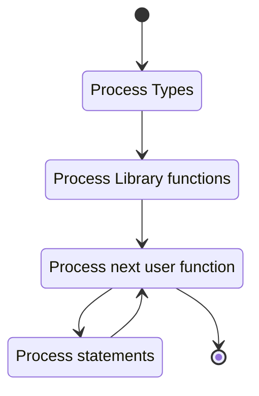

# Introduction

A compiler to convert Cairo's intermediate representation "Sierra" code to MLIR.

## Compilation process

```mermaid
stateDiagram-v2
    state "Process Types" as types
    state "Process Library functions" as libfuncs
    state "Process next user function" as funcs
    state "Process statements" as statements
    [*] --> types
    types --> libfuncs
    libfuncs --> funcs
    funcs --> statements
    statements --> funcs
    funcs --> [*]
```
