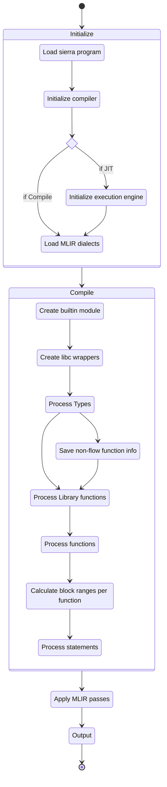

# MLIR

<!-- toc -->

structure:

- INTRO: the lead up to MLIR:
	- LLVM background
	- Then machine learning algos with HW acceleleration
	- Compiler infra proliferation, duplication
	- LLVM unsuitability
- WHAT
	- Enter MLIR
	- So what is MLIR?
- WHY
	- Advantages over LLVM
		- Running on GPU
	- Meanwhile in cryptoland
	- Cairo
	-  Why (use MLIR in the context of Cairo)?
- HOW
	- sierra2mlir compilation process
	- how to run emitted code
	- example: felt add
	- example: conditional
- BUT
- CONCLUSION

---
I love jazz. Of all the jazz styles I love, jazz fusion is the one I enjoy most, because I find any fusion of different things more stimulating.
Something especially interesting is happening at the intersection of programming language theory, compiler implementation, and applied cryptography.

But the thing with jazz fusion is that it's harder to get into unless you're familiar with the elements being combined. Let me show you a few songs, and how we're mixing it up. 
If you're familiar with one of these topics, bear with us, I promise it's worth it in the end.

Put on your seatbelts. 3, 2, 1... 


## Intro beat

### Compilers, LLVM

Some 20-something years ago at the University of Illinois a group of compiler researchers had need of a more flexible infrastructure. What they developed came to be known as LLVM and has since become the foremost compiler tooling project. It powers many of the analysis and code generation components of the compilers for Clang, Swift, Rust, and many more languages.

From the 2004 CGO [paper](https://llvm.org/pubs/2004-01-30-CGO-LLVM.html) introducing it: 

> The LLVM compiler framework and code representation together provide a combination of key capabilities that are important for practical, lifelong analysis and transformation of programs. 

At the heart of LLVM is LLVM IR, it's Intermediate Representation. IRs are essentially a combination of data formats and algorithms that allow best expressing the properties a tool wishes to guarantee or prove about code.

An example of this is the fact that LLVM IR is what's known as an SSA form, or Static Single Assignment, in which each variable will have a value assigned only once. This allows the compiler to reason about it better than otherwise, it enables analysis and optimizations such as dead code elimination, constant propagation, constant folding, and facilitates other stages such as register allocation.  

All this to say that IRs are a compiler writer's way of solving problems by building abstraction ladders, and LLVM became the de facto backend platform for modern compilers.

### Rise of AI

You may have become aware that machine learning algorithms and their applications are now a big deal. The driver of many economic fortunes and solutions to problems we only dreamed of solving before, the statistical school of AI has settled (?) on a set of techniques which involve dealing with numerical operations on enormous matrices of numbers, and stringing together large numbers of these operations into computation graphs. The fundamental elements in these computational graphs are things like matrix multiplications, convolutions, data manipulations and data movements. This sounds very computationally expensive, and it is, and so the industry has (and is) going to great lengths to scale these approaches, make them cheaper and more effective on ever larger sets of data. 

At some point a key observation was made: many of the problems these algorithms solve have inherent or given parallelism, and that we already had an industry producing machines specifically designed for embarassingly parallel numerical problems, namely shaders running on GPUs. Thus the first wave of this effort was repurposing video graphics card hardware to make them applicable to this new area.

Why did we change the tune from LLVM to AI and graphics card? Because as they matured, these algorithms, models, techniques, tools, libraries were standarized into frameworks that could be used by many a layman programmer, and that required appropriate languages in which to express them, and their compilers. 

Since LLVM had an IR that could, with some effort, be abstracted over GPU processors as well, it was used in tools such as PyTorch and Tensorflow to produce the code that would run on these graphical processing units. 
New hardware was designed, and LLVM was again used to target these new tensor processing units.

As a result, Tensorflow has a number of compiler components embedded in it, made by different vendors: Google has XLA, NVIDIA has TensorRT, Intel has NGraph, all of which integrate with the Tensorflow optimizer and code generator and are very hardware specific, but do not share common infrastructure. 


### Back to languages

In these intervening years since the early 2000s, the pendulum has swung back from dynamic to statically typed languages with more advanced type systems and code analysis phases. LLVM enabled Clang, and then new languages such as Rust, Julia, and Swift. Something these projects share in common is that they have found that many language implementation problems are best modeled at higher abstraction levels, and implemented their own intermediate representations to solve domain-specific problems, like language/library-specific optimizations, flow-sensitive type checking (e.g. for linear types), and to improve the implementation of the lowering process. Swift has SIL, Rust has MIR, and so on.


In other words people started to realize that the complexity of the software stack above the low level IR was very high since software reuse was low and quality so variable. 

After twenty years, expanding hardware targets, and changing problem spaces, LLVM was starting to be found lacking for certain areas.

## What (is MLIR?)

<div width=10%>

</div>

Out of this came [MLIR](https://mlir.llvm.org/) (Multi-Level Intermediate Representation), a project started by Chris Lattner et al with the aim to build a common infrastructure to support all these different subsystems, and to learn from the mistakes made and lessons learned in the development of LLVM. 

I highly encourage you to read the introductory [paper](https://arxiv.org/pdf/2002.11054.pdf) from whence these graphics came, as it is very readable, or to listen to the talk Lattner and Shpeisman gave presenting it. 

> MLIR aims to address software fragmentation, improve compilation for heterogeneous hardware, significantly reduce the cost of building domain specific compilers, and aid in connecting existing compilers together.

There are several types of intermediate representations: linear (like assembly, a sequence of instructions), tree-like (like ASTs), graph-like (like data-flow or call-graphs). As the project site states, "MLIR is intended to be a hybrid IR which can support multiple different requirements in a unified infrastructure."

Unlike LLVM IR where there is one central IR containing a complete set of instructions to represent the CPU/GPU programs in MLIR there is no one IR. 

Rather, MLIR provides a set of very abstract concepts: dialects, operations, regions, etc. 

From the [glossary](https://mlir.llvm.org/getting_started/Glossary/):

	> A dialect is a grouping of functionality which can be used to extend the MLIR system.
	> A dialect creates a unique namespace within which new operations, attributes, and types are defined. This is the fundamental method by which to extend MLIR.
	> In this way, MLIR is a meta-IR: its extensible framework allows it to be leveraged in many different ways

An **operation** is unit of code in MLIR. Operations are the building blocks for all code and computations represented by MLIR. They are fully extensible (there is no fixed list of operations) and have application-specific semantics.

When implementing the code emitter, operations could map to procesor instructions. When implementing an AST, nodes representing type conversions, function calls, language operands could be mapped to operations. 

Operations can have an arbitrary number of operands, results, and attributes, and may contain an arbitrary number of regions. 

A **region** is a control-flow-graph of MLIR blocks. 

A **block**, or basic block, is a sequential list of operations without control flow.

Note that this creates a nested IR structure, as regions consist of blocks, which in turn, consist of a list of operations. Regions are a powerful mechanism to allow nested operations and localize information, simplifying code analysis and transformation.

A **module** is an operation which contains a single region containing a single block that is comprised of operations, providing an organizational structure for MLIR operations.

MLIR allows for multiple dialects, even those outside of MLIR's codebase, to co-exist together within one module.

In the context of MLIR, conversion is distinct from translation. 
The transformation of code represented in a dialect is called conversion, and can be either inter-dialect (when the conversion is into a semantically equivalent representation in another dialect) or intra-dialect, whereas translation refers to a transformation between MLIR and an external representation.

Thus an application using MLIR will typically use a collection of dialects as needed. 

### What are the advantages over LLVM?

So you're writing a compiler, or need to add a backend to an existing compiler. Aside from code reuse across the industry, what advantages does MLIR provide? Why would you choose it over LLVM?

To begin with, the choice is not that binary since MLIR include an LLVM IR dialect to which you can convert your application-specific dialect and thus leverage the existing LLVM toolchain.

MLIR also tries to provide universal patterns or passes that can just apply to suitable operations without hardcoding them.

So MLIR allows you to easily defined your own dialect, pick from a growing ecosystem of midle and low level dialects targeting different computation models, and integrate them into your own domain-specific compiler.

As [Lei Zhang](https://www.lei.chat/posts/compilers-and-irs-llvm-ir-spirv-and-mlir/) says: 

> In other words, if LLVM IR is centralized by nature and favors unified compiler flows, the MLIR infrastructure and its dialect ecosystem is decentralized by nature and favors diverse compiler flows.
> What is quite powerful is that MLIR enables different levels to be represented using the same infrastructure; so that the flow between different levels can become seamless.

The UNIX way!


Other benefits include:
- Source code location tracking by default (each operand has a source code memory address attribute so errors directly point to the line of source code in which error occured)
- All functions run on multiple cores by default
- Optimizations done by other languages can be reused
- Reuse LLVM for machine code generation

Finally, if your domain does benefit from running all or some of your code in a GPU, TPU, or ASIC, MLIR provides a way to either reuse an existing dialect targeting that computation model and hardware by writing a conversion to it, and plugging in a code generator for final translation.

It includes dialects for SPIR-V, a general [GPU](https://mlir.llvm.org/docs/Dialects/GPU/) dialect and specific ones for [NVidia](https://mlir.llvm.org/docs/Dialects/NVGPU/) and [AMD](https://mlir.llvm.org/docs/Dialects/AMDGPU) GPUs.
	
All these advantages are direct results of MLIR's abstraction level.

## Why?

Let's change the tune again. 

In the land of blockchains, cryptocurrencies, and distributed finance, several developments have converged:

First, the more established blockchains have paralleled the story in the machine learning world, offloading as much hashing as possible to GPUs and later ASICs (fating us mere mortals to scrabbling for the crumbs or resigned to playing emacs tetris on my Raspberry Pi). Newer chains and L2s are expected to follow the same path.

Second, as their applications have become more mainstream (albeit with ups and downs), two concerns have taken center stage: scalability, and privacy. 
Blockchains are not known for their efficiency so effort has gone into trying to have the best of both worlds; in part by moving away from Proof of Work, moving work to L2s, and also by turning back to guarantees provided by cryptographic techniques. As new techniques have been discovered and older ones have matured, Zero Knowledge Proof systems have emerged as the predominant area from which solutions to these two problems can be built.

But as is well known, even though there is a good amount of gatekeeping, cryptography is not something one can pick up over the weekend and "roll one's own", especially in developing areas such as ZKP. It's not _just_ that their proper use is difficult, or the fact that many components arestill in alpha, but because  translating computation in a programming language to a form that can be input to these cryptographic primitives takes a lot of work and some ingenuity. Most ZKP protocols involve arithmetization, which is the process of representing computation in a numerical format that can be used by the proving system, usually by taking the instructions in the computation and building an expression graph of operations on bits called an arithmetic circuit, and then generating an _execution trace_, which very briefly is a matrix of field elements representing the evolution of the computation over time. This execution trace is fed to the prover. 

To encapsulate these processes virtual machines have been designed and implemented to generate these numerical execution traces and provide the computational guarantees, such as [Miden](https://github.com/0xPolygonMiden/miden-vm) and [cairo-rs](https://github.com/lambdaclass/cairo-rs/pulls). Once you have a virtual machine, you need a compiler and an intermediate representation.

You also can't accept just any program since you need to know that it's execution is provable, unless you're willing to accept the possibility of nonterminating programs, invalid transactions which consume excessive gas, the production of invalid or incomplete traces, and having the prover just quit in the middle. Type theory and intermediate representations within compilers  have become one of the strongest tools we have for producing code that has properties we can mechanically reason about and check.

So in short, the need to run on more diverse hardware, to incorporate programming language technology, to enable the easy use of difficult cryptographic primitives, to transport guarantees from developer tooling to execution layers, 
have all come together to bring about a small renaissance of language implementation in the crypto world. 

### Cairo & Sierra

[Cairo](https://github.com/starkware-libs/cairo) is a "language for creating provable programs for general computation", through the use of STARK-based validity proofs.
If you're not coming from a cryptography background, ZKP and STARKS are too deep a rabbithole for one article spanning so many topics, it suffices to say that STARKs enable blockchain scaling by efficiently proving the integrity of computations.

   > STARKs (Scalable, Transparent ARgument of Knowledge) are a proof system that enables the proving and verification of computations. It allows processing a big computation, generating a proof for the computation’s correctness, and then verifying the proof in very few steps.
   > - [www.starknet.io](https://www.starknet.io/en/posts/engineering/starks-starkex-and-starknet)

As Cairo matures improvements have been added, such as a linear type system implementing an ownership system similar to Rust, and an intermediate representation providing guarantees. Programming in Cairo is a bit different than your average von Neumann machine-based language: programs written in it run under a nondeterministic, immutable, contiguous memory model to ensure that all relevant memory has proper values, and that relevant values are not destroyed before the proof is generated, i. e. all correct programs are provable. 

The Cairo compiler eventually compiles Cairo code down to a "Cairo assembly", which is what the virtual machines runs to compute results and generate traces. However as mentioned before, not all representations are adequate for all tasks, so Cairo introduced Sierra (**S**afe **I**nt**E**rmediate **R**ep**R**esent**A**tion).

Sierra's goal is to be correct by construction, by restricting 

### Why use MLIR in the context of Cairo?

Cairo is also being used to build StarkNet, a permissionless Ethereum layer 2 network on which provable smart contracts can be deployed.
Nodes on the network receive transactions and must verify they are valid before going about the business of generating the proof.
The contract code must be run with the transaction inputs to generate the state change, the proof, and verify 

Another motivation is developer experience and tooling quality. Before being able to deploy said contracts, the code must be written and tested, and being able to run Cairo code faster improves turnaround time in the development loop. 

- Enable faster checking of Cairo contract TX
- Faster Gas computation
- To enable better L2 sequencers
- To enable better developer tooling

<!-- ### What optimizations does it have or enable? -->

## How (does one use it)?

In our context, the Cairo & StarkNet software stack, most is transitioning or being developed in Rust, so we would like to be able to integrate into that seamlessly.

MLIR comes with a [C-compatible API](https://mlir.llvm.org/docs/CAPI/, which can be easily interfaced with. [mlir-sys](https://crates.io/crates/mlir-sys) provides auto-generated bindings to this interface, and [melior](https://crates.io/crates/melior-next) provides a somewhat more idiomatic wrapper around it.

MLIR as a library is part of the LLVM distribution, so if you have the latest LLVM as a system library, you will have access to MLIR. 

Our project resides at [`github.com/lambdaclass/cairo_sierra2mlir`](https://github.com/lambdaclass/cairo_sierra2mlir). You can find detailed setup instructions there that should leave you with a working development environment.

### sierra2mlir

- compilation process




- parse sierra

```
cairo_lang_sierra::ProgramParser::new()
            .parse(fs::read_to_string(input).unwrap().as_str())
            .unwrap(),
```

- [src](https://github.com/lambdaclass/cairo_sierra2mlir/blob/main/sierra2mlir/benches/execution.rs)

```rust
pub fn criterion_benchmark(c: &mut Criterion) {
    let program = ProgramParser::new().parse(include_str!("programs/fib.sierra")).unwrap();
    let engine = sierra2mlir::execute(&program, false, 1).unwrap();

    unsafe {
        engine.invoke_packed("fib::fib::main", &mut []).unwrap();
    };

    c.bench_with_input(BenchmarkId::new("MLIR", 1), &(engine), |b, engine| {
        b.iter(|| {
            unsafe {
                engine.invoke_packed("fib::fib::main", &mut []).ok();
            };
        });
    });

    // Requires sierra files to be generated previously.
    let mut compile_group = c.benchmark_group("compile");

    let base_dir = env::var("CARGO_MANIFEST_DIR").unwrap();

    for entry in fs::read_dir(format!("{base_dir}/../examples")).unwrap() {
        let entry = entry.unwrap();
        let path = fs::canonicalize(entry.path()).unwrap();

        if let Some(ext) = path.extension() {
            if ext.eq_ignore_ascii_case("sierra") {
                compile_group.bench_function(
                    &format!("examples/{}", path.file_stem().unwrap().to_string_lossy()),
                    move |x| {
                        let sierra_code = fs::read_to_string(&path).unwrap();
                        let program = ProgramParser::new().parse(&sierra_code).unwrap();
                        x.iter(|| {
                            sierra2mlir::compile(&program, false, false, false, 1).unwrap();
                        });
                    },
                );
            }
        }
    }
}
```

#### Felt Add

Let's take a look at an example short enough to inspect its transformation process. 
This simple function takes a Felt (a 252-bit Field Element) and returns a struct with two values:

```cairo
fn something(a: felt252) -> (felt252, felt252) {
    (a + 2, a - 2)
}
```

The cairo compiler outputs the following sierra:

```sierra
type felt252 = felt252;
type Tuple<felt252, felt252> = Struct<ut@Tuple, felt252, felt252>;

libfunc felt252_const<2> = felt252_const<2>;
libfunc dup<felt252> = dup<felt252>;
libfunc felt252_add = felt252_add;
libfunc felt252_sub = felt252_sub;
libfunc struct_construct<Tuple<felt252, felt252>> = struct_construct<Tuple<felt252, felt252>>;
libfunc store_temp<Tuple<felt252, felt252>> = store_temp<Tuple<felt252, felt252>>;

felt252_const<2>() -> ([1]);
dup<felt252>([0]) -> ([0], [3]);
felt252_add([3], [1]) -> ([2]);
felt252_const<2>() -> ([4]);
felt252_sub([0], [4]) -> ([5]);
struct_construct<Tuple<felt252, felt252>>([2], [5]) -> ([6]);
store_temp<Tuple<felt252, felt252>>([6]) -> ([7]);
return([7]);

simple::simple::something@0([0]: felt252) -> (Tuple<felt252, felt252>);
```

The `sierra2mlir` pass will produce a MLIR module 

```mlir
module {
  func.func @felt252_add(%arg0: i256, %arg1: i256) -> i256 attributes {llvm.dso_local, llvm.linkage = #llvm.linkage<internal>, passthrough = ["norecurse", "alwaysinline", "nounwind"]} {
    %0 = arith.addi %arg0, %arg1 : i256
    %c3618502788666131213697322783095070105623107215331596699973092056135872020481_i256 = arith.constant 3618502788666131213697322783095070105623107215331596699973092056135872020481 : i256
    %1 = arith.cmpi uge, %0, %c3618502788666131213697322783095070105623107215331596699973092056135872020481_i256 : i256
    cf.cond_br %1, ^bb2, ^bb1
  ^bb1:  // pred: ^bb0
    return %0 : i256
  ^bb2:  // pred: ^bb0
    %2 = arith.subi %0, %c3618502788666131213697322783095070105623107215331596699973092056135872020481_i256 : i256
    return %2 : i256
  }
  func.func @felt252_sub(%arg0: i256, %arg1: i256) -> i256 attributes {llvm.dso_local, llvm.linkage = #llvm.linkage<internal>, passthrough = ["norecurse", "alwaysinline", "nounwind"]} {
    %0 = arith.subi %arg0, %arg1 : i256
    %c0_i256 = arith.constant 0 : i256
    %1 = arith.cmpi slt, %0, %c0_i256 : i256
    cf.cond_br %1, ^bb2, ^bb1
  ^bb1:  // pred: ^bb0
    return %0 : i256
  ^bb2:  // pred: ^bb0
    %c3618502788666131213697322783095070105623107215331596699973092056135872020481_i256 = arith.constant 3618502788666131213697322783095070105623107215331596699973092056135872020481 : i256
    %2 = arith.addi %0, %c3618502788666131213697322783095070105623107215331596699973092056135872020481_i256 : i256
    return %2 : i256
  }
  func.func @"struct_construct<Tuple<felt252, felt252>>"(%arg0: i256, %arg1: i256) -> !llvm.struct<packed (i256, i256)> attributes {llvm.dso_local, llvm.linkage = #llvm.linkage<internal>, passthrough = ["norecurse", "alwaysinline", "nounwind"]} {
    %0 = llvm.mlir.undef : !llvm.struct<packed (i256, i256)>
    %1 = llvm.insertvalue %arg0, %0[0] : !llvm.struct<packed (i256, i256)> 
    %2 = llvm.insertvalue %arg1, %1[1] : !llvm.struct<packed (i256, i256)> 
    return %2 : !llvm.struct<packed (i256, i256)>
  }
  func.func @"simple::simple::something"(%arg0: i256) -> !llvm.struct<packed (i256, i256)> attributes {llvm.dso_local, llvm.emit_c_interface} {
    cf.br ^bb1(%arg0 : i256)
  ^bb1(%0: i256):  // pred: ^bb0
    %c2_i256 = arith.constant 2 : i256
    %1 = call @felt252_add(%0, %c2_i256) : (i256, i256) -> i256
    %c2_i256_0 = arith.constant 2 : i256
    %2 = call @felt252_sub(%0, %c2_i256_0) : (i256, i256) -> i256
    %3 = call @"struct_construct<Tuple<felt252, felt252>>"(%1, %2) : (i256, i256) -> !llvm.struct<packed (i256, i256)>
    return %3 : !llvm.struct<packed (i256, i256)>
  }
}
```

#### Conditionals

```
fn mul_if_not_zero(a: felt252) -> felt252 {
    match a {
        0 => 0,
        _ => a * 2,
    }
}
```

```
type felt252 = felt252;
type NonZero<felt252> = NonZero<felt252>;

libfunc dup<felt252> = dup<felt252>;
libfunc felt252_is_zero = felt252_is_zero;
libfunc branch_align = branch_align;
libfunc drop<felt252> = drop<felt252>;
libfunc felt252_const<0> = felt252_const<0>;
libfunc store_temp<felt252> = store_temp<felt252>;
libfunc jump = jump;
libfunc drop<NonZero<felt252>> = drop<NonZero<felt252>>;
libfunc felt252_const<2> = felt252_const<2>;
libfunc felt252_mul = felt252_mul;
libfunc rename<felt252> = rename<felt252>;

dup<felt252>([0]) -> ([0], [1]);
felt252_is_zero([1]) { fallthrough() 7([2]) };
branch_align() -> ();
drop<felt252>([0]) -> ();
felt252_const<0>() -> ([3]);
store_temp<felt252>([3]) -> ([4]);
jump() { 12() };
branch_align() -> ();
drop<NonZero<felt252>>([2]) -> ();
felt252_const<2>() -> ([5]);
felt252_mul([0], [5]) -> ([6]);
store_temp<felt252>([6]) -> ([4]);
rename<felt252>([4]) -> ([7]);
return([7]);

felt_is_zero::felt_is_zero::mul_if_not_zero@0([0]: felt252) -> (felt252);
```


## But?

As said, MLIR is a young project. Although there is a healthy number of case studies and [users](https://mlir.llvm.org/users/), enough to look at the sunset sky and muse "this is the way", there are a few caveats.

First, although it is clear that the project has made an effort, documentation is scarce. The API is documented and there are great getting started tutorials, but if you stray off the signalled path, you end up looking at test code, other projects, and trial and error.

Second, the project is written in C++. It provides a C-compatible API with which to fashion bindigs in your language, but it is under development and unstable. The Python bindings are also under development and not enabled by default. The Rust bindings are somewhat auto-generated and not very mature. You may end up having to build some tools to build this tool to build the tool you want to ship, also known as yak shaving of an especially hairy breed.

Third, like any powerful tool that allows one to operate on a high level of abstraction, it requires you to be able to bridge abstraction layers and truly understand your goals and the obstacles you face in reaching them. Knowledge of compiler technology and the techniques and vocabulary involved is a must. Perhaps with more maturity other tools will be able to be fashioned which can hide complexity for more specific domains. 

## Conclusions

> TODO

We would like to salute and thank the team and community behind LLVM and MLIR. Foundational technologies are rare, difficult to develop, and require great insight and vision to come to term, and MLIR is definitely one of them.	

## References and Resources

- [MLIR Homepage](https://mlir.llvm.org/)
- 2019 EuroLLVM Developers’ Meeting: T. Shpeisman & C. Lattner “MLIR: Multi-Level Intermediate Representation Compiler Infrastructure” [Video](https://www.youtube.com/watch?v=qzljG6DKgic) and [Slides](https://llvm.org/devmtg/2019-04/slides/Keynote-ShpeismanLattner-MLIR.pdf)
- MLIR Tutorial [Video](https://www.youtube.com/watch?v=Y4SvqTtOIDk) and [Slides](https://llvm.org/devmtg/2020-09/slides/MLIR_Tutorial.pdf)
- [Yizhou Shan's notes on MLIR](http://lastweek.io/notes/MLIR/)
- [Lei Zhang's "Compilers and IRs: LLVM IR, SPIR-V, and MLIR"](https://www.lei.chat/posts/compilers-and-irs-llvm-ir-spirv-and-mlir/)


---
Notas y material no parte del text:

Ref: The other side of the coin

---
Ref: opengenus

	- [src](https://iq.opengenus.org/mlir-compiler-infrastructure/)
