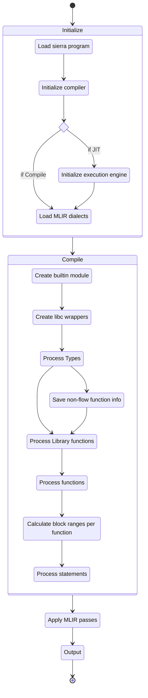

# MLIR

structure:

- INTRO
	- LLVM background
	- Lead up to MLIR:
		- Then machine learning algos
		- HW acceleleration
		- Compiler infra proliferation, duplication
		- LLVM unsuitability
- WHAT
	- Enter MLIR
	- So what is MLIR?
- WHY 
	- Advantages over LLVM
		- Running on GPU
	- Meanwhile in cryptoland
		- Goals
		- HW accelerated crypto, GPU, ASIC future
	-  Why (use MLIR in the context of Cairo)?
- HOW
	- sierra2mlir compilation process
	- how to run emitted code
	- example: felt add
	- example: conditional
- BUT
- CONCLUSION 

---
I love jazz. Of all the jazz styles I love, jazz fusion is the one I enjoy most, because I find any fusion of different things more stimulating.
Something especially interesting is happening at the intersection of programming language theory, compiler implementation, and applied cryptography.

But the thing with jazz fusion is that it's harder to get into unless you're familiar with the elements being combined. Let me show you a few songs, and how we're mixing it up. 

Put on your seatbelts. 3, 2, 1... Let's jam.

## Intro beat

### Compilers, LLVM

Some 20-something years ago at the University of Illinois a group of compiler researchers had need of a more flexible infrastructure. What they developed came to be known as LLVM and has since become the foremost compiler tooling project. It powers many of the analisys and code generation components of the Clang, Swift, Rust, and many more languages.

At the heart of LLVM is LLVM IR, it's intermediate representation. IRs are compiler writer's way of solving problems by building abstraction ladders, they are essentially a combination of data formats and algorithms that allow best expressing the properties a tool wishes to guarantee or prove about code.

You may have become aware that machine learning algorithms are now a big deal. The driver of many economic fortunes and solutions to problems we only dreamed of solving before, AI has settled on a set of techniques which involve dealing with math on enormous matrices of numbers, and stringing together large numbers of these operations into graphs. 
This sounds very computationally expensive, and it is, and so the industry has (and is) going to great lengths to scale

The first wave of this was repurposing video graphics card hardware to make them applicable to this.

> ELABORATE

## What? (is MLIR?)

[MLIR](https://mlir.llvm.org/) (Multi-Level Intermediate Representation) is a young project started by Chris Lattner et al of LLVM fame with the goal of solving some issues that have arisen in compilerland. 

If you think of llvm ir as an abstraction of all assembly langs
Mlir is a level above.

> Ref Paper: MLIR: A Compiler Infrastructure for the End of Moore’s Law

MLIR aims to address software fragmentation, improve compilation for heterogeneous hardware, significantly reduce the cost of building domain specific compilers, and aid in connecting existing compilers together.

### What are is advantages over llvm?

> Ref: The other side of the coin

- Source code location tracking by default
- All functions run on multiple cores by default (uses OpenMP)
- Better code reuse for compiler stack (for new library and hardware) and hence, optimizations done by other languages can be reused
- Intermediate IR to capture data flow information and apply optimizations, better source code tracking than LLVM, flexible design, Reuse LLVM for Machine code generation

> Ref: opengenus

### Running on GPU

```	
	In terms of evolution, using LLVM for GPU compilation will require moving away from LLVM IR itself, I think. The tradeoffs and semantics start diverging quickly, and even different GPU-based IRs may/will have slightly different semantics. So, a container IR would be ideal to allow different middle/back-ends express their own semantic needs. Do you see MLIR as that container IR? How would different backends use MLIR to further describe their semantics (say SPIRV vs DXIL vs CUDA).

	I think MLIR can be the infrastructure for such purposes. It provides a consistent infra and scaffolding for different variants of GPU IRs. What op and what semantics to have is up to each GPU IR to define. Actually as of right now we already have multiple GPU related dialects, GPU dialect being vendor-agonistic common host/device abstractions, NVGPU dialect/AMDGPU dialect for NVIDIA/AMD-specific stuff, SPIR-V dialect for lowering and existing MLIR system, etc.

	https://mlir.llvm.org/docs/Dialects/GPU/
	https://mlir.llvm.org/docs/Dialects/NVGPU/
	https://mlir.llvm.org/docs/Dialects/AMDGPU/
```
- [src](https://www.lei.chat/posts/compilers-and-irs-llvm-ir-spirv-and-mlir/)

## Why (use MLIR in the context of Cairo)?

> ELABORATE

- Parallel with intro beat story
- initial wave of repurposing video graphics hardware, then app specific HW

A similar story has been playing out in the area of cryptography applied to blockchains: as new techniques have been discovered, and older ones matured, the are of Zero Knowledge Proofs has exploded. 
type systems, virtual machines, and intermediate representations are some of the tools that have been brought to bear in the struggle to produce software products that transport guarantees to execution layers. 

Virtual machines have been designed to provide computational guarantees about the programs they run. 

Type systems help in producing code that has properties the tools can reason 
about, such as termination or bounded resource consumption of transaction fees. 

> ELABORATE

- Enable faster checking of Cairo contract TX
- Faster Gas computation

### Why target MLIR instead of something like C, Rust?

Targeting a higher level language such as C or Rust would seem to be easier in the short run, but at the cost of having to take into account the semantics of that language implementation and having to ensure that the code being emitted matches your semantics.

> ELABORATE

<!-- ### What optimizations does it have or enable? -->

## How (does one use it)?

> ELABORATE

- MLIR ships with LLVM
- Rust: Inkwell Melior
- Dialects
- Operations

### sierra2mlir

- compilation process



### How to run 
- [src](https://github.com/lambdaclass/cairo_sierra_2_MLIR/blob/main/sierra2mlir/benches/execution.rs)

```rust
pub fn criterion_benchmark(c: &mut Criterion) {
    let program = ProgramParser::new().parse(include_str!("programs/fib.sierra")).unwrap();
    let engine = sierra2mlir::execute(&program, false, 1).unwrap();

    unsafe {
        engine.invoke_packed("fib::fib::main", &mut []).unwrap();
    };

    c.bench_with_input(BenchmarkId::new("MLIR", 1), &(engine), |b, engine| {
        b.iter(|| {
            unsafe {
                engine.invoke_packed("fib::fib::main", &mut []).ok();
            };
        });
    });

    // Requires sierra files to be generated previously.
    let mut compile_group = c.benchmark_group("compile");

    let base_dir = env::var("CARGO_MANIFEST_DIR").unwrap();

    for entry in fs::read_dir(format!("{base_dir}/../examples")).unwrap() {
        let entry = entry.unwrap();
        let path = fs::canonicalize(entry.path()).unwrap();

        if let Some(ext) = path.extension() {
            if ext.eq_ignore_ascii_case("sierra") {
                compile_group.bench_function(
                    &format!("examples/{}", path.file_stem().unwrap().to_string_lossy()),
                    move |x| {
                        let sierra_code = fs::read_to_string(&path).unwrap();
                        let program = ProgramParser::new().parse(&sierra_code).unwrap();
                        x.iter(|| {
                            sierra2mlir::compile(&program, false, false, false, 1).unwrap();
                        });
                    },
                );
            }
        }
    }
}
```

### sierra2mlir examples

#### Felt Add

#### Conditionals

## But?

As said, MLIR is a young project. Although there is a healthy number of case studies and [users](https://mlir.llvm.org/users/), enough to look at the sunset sky and muse "this is the way", there are a few caveats.

First, although it is clear that the project has made an effort, documentation is scarce. The API is documented and there are great getting started tutorials, but if you stray off the signalled path, you end up looking at test code, other projects, and trial and error.

Second, the project is written in C++. It provides a C-compatible API with which to fashion bindigs in your language, but it is under development and unstable. The Python bindings are also under development and not enabled by default. The Rust bindings are somewhat auto-generated and not very mature. You may end up having to build some tools to build this tool to build the tool you want to ship, also known as yak shaving of an especially hairy breed.

Third, like any powerful tool that allows one to operate on a high level of abstraction, it requires you to be able to bridge abstraction layers and truly understand your goals and the obstacles you face in reaching them. Knowledge of compiler technology and the techniques and vocabulary involved is a must. Perhaps with more maturity other tools will be able to be fashioned which can hide complexity for more specific domains. 

## Conclusions

> TODO

We would like to salute and thank the team and community behind LLVM and MLIR. Foundational technologies are rare, difficult to develop, and require great insight and vision to come to term, and MLIR is definitely one of them.	

## References and Resources

- [MLIR Homepage](https://mlir.llvm.org/)
- 2019 EuroLLVM Developers’ Meeting: T. Shpeisman & C. Lattner “MLIR: Multi-Level Intermediate Representation Compiler Infrastructure” [Video](https://www.youtube.com/watch?v=qzljG6DKgic) and [Slides](https://llvm.org/devmtg/2019-04/slides/Keynote-ShpeismanLattner-MLIR.pdf)
- MLIR Tutorial [Video](https://www.youtube.com/watch?v=Y4SvqTtOIDk) and [Slides](https://llvm.org/devmtg/2020-09/slides/MLIR_Tutorial.pdf)
- [Yizhou Shan's notes on MLIR](http://lastweek.io/notes/MLIR/)
- [Lei Zhang's "Compilers and IRs: LLVM IR, SPIR-V, and MLIR"](https://www.lei.chat/posts/compilers-and-irs-llvm-ir-spirv-and-mlir/)


---
Notas y material no parte del text:

---
Ref Lex Fridman Podcast #162: Jim Keller

	49:50 Hardware for deep learning

		but but speaking about this uh you know uh this walk along the path of innovation
		towards uh the dumb things being smarter than humans you are now the cto of uh
		tens torrent as of two months ago they uh build hardware for deep learning
		how do you build scalable and efficient deep learning this is such a fascinating space yeah yeah so it's interesting so
		um up until recently i thought there was two kinds of computers there are serial computers
		that run like c programs and then there's parallel computers so the way i think about it is you know
		parallel computers you have given parallelism like gpus are great because you have a million pixels
		and modern gpus run a program on every pixel they call the shader program right so or like finite element analysis
		you you build something you know you make this into little tiny chunks you give each chunk to a computer so you're giving all these chunks a
		parallel something like that but most c programs you write this linear narrative and you have to make it go fast to make
		it go fast you predict all the branches all the data fetches and you run that more in parallel but that's found
		parallelism ai is i'm still trying to decide how
		fundamental this is it's a given parallelism problem but the way people
		describe the neural networks and then how they write them in pi torch it makes graphs yeah
		that might be fundamentally different than the gpu kind of parallelism yeah it might be because the when you run the gpu program
		on all the pixels you're running like you know depends you know this group of pixels say it's
		background blue and that runs a really simple program this pixel is you know some patch of your face so you
		have some really interesting shader program to give you impression of translucency but the pixels themselves don't talk to
		each other there's no graph right so you you do the image and then
		you do the next image and you do the next image and you run 8 million pixels 8 million
		programs every time and modern gpus have like 6 000 thread engines in them so you know to
		get 8 million pixels each one runs a program on you know 10 or 20 pixels and that's how that's how they
		work but there's no graph but you think graph might be a totally new way to think about hardware so raja
		gadori and i've been having this good conversation about giving versus found parallelism and then
		the kind of walk cause we got more transistors like you know computers way back when did stuff on scalar data then we did it on
		vector data famous vector machines now we're making computers that operate on matrices
		right and then the the category we we said that was next was spatial like imagine you have so much data that
		you know you want to do the compute on this data and then when it's done it says send the result to this pile of data run some
		software on that and it's better to to think about it spatially than
		to move all the data to a central processor and do all the work so especially i mean moving in the space
		of data as opposed to moving the data yeah you have a you have a petabyte data space spread across some huge array of
		computers and when you do a computation somewhere you send the result of that computation
		or maybe a pointer to the next program some other piece of data and do it but i think a better word might be graph
		and all the ai neural networks are graphs do some computations send the result here do another computation do a data
		transformation do a merging do a pooling do another computation is it possible to
		compress and say how we make this thing efficient this whole process efficient that's different so first uh
		the fundamental elements in the graphs are things like matrix multiplies convolutions data manipulations and data
		movements so gpus emulate those things with their little singles
		you know basically running a single threaded program and then there's a you know nvidia calls
		it a work where they group a bunch of programs that are similar together so for efficiency and instruction use
		and then at a higher level you kind of you take this graph and you say this part of the graph is a matrix multiplier
		which runs on these 32 threads but the model at the bottom was
		built for running programs on pixels not executing graphs so it's emulation yes 

	so is it possible to build something that natively runs graphs 

		yes so that's what ten storm did
		so where are we on that how like in the history of that effort are we in the early days yeah i think so
		tense torrance started by a friend of mine labisha bajak and i i was his first investor so i've been
		you know kind of following him and talking to him about it for years and in the fall when i was considering
		things to do i decided you know the we we held a conference last year with a
		friend organized it and and we we wanted to bring in thinkers and two of the people were andre
		carpassi and chris lattner and andre gave this talk on youtube
		called software 2.0 which i think is great which is we went from
		programmed computers where you write programs to data program computers you know like the futures you know of
		software as data programs the the networks and i think that's true and then
		chris has been work he worked on llvm the low-level virtual machine which became the intermediate representation
		for all compilers and now he's working on another project called mlir which is mid-level
		intermediate representation which is essentially under the graph about how do
		you represent that kind of computation and then coordinate large numbers of potentially heterogeneous computers
		and and i would say technically tense torrents you know two pillars are those those
		those two ideas software 2.0 and mid-level representation but it's in service of executing graph
		programs the hardware is designed to do that so it's including the hardware piece yeah and then the other cool thing
		is for a relatively small amount of money they did a test chip and two production chips
		so it's like a super effective teams and and unlike some ai startups where if you
		don't build the hardware to run the software that they really want to do then you have to fix it by writing lots
		more software so the hardware naturally does matrix multiply convolution the data
		manipulations and the data movement between processing elements that
		that you can see in the graph which i think is all pretty clever and that's that's what i'm i'm working

	56:44 Making neural networks fast at scale

		on now so uh the i think it's called the grace call processor uh introduced last year it's
		uh you know there's a bunch of measures of performance we're talking about horses it seems to outperform 368 trillion
		operations per second seems to outperform nvidia's tesla t4 system so these are just numbers
		what do they actually mean in real world perform like what are the metrics for you that you're chasing in
		in your horse race like what do you care about well first so the the native language of
		you know people who write ai network programs is pie torch now by torch tensorflow there's a couple others
		the pi torch is one over tensor flows it's just i'm not an expert on that i i know many people have switched from
		tensorflow to pi torch yeah and there's technical reasons for it and i use both both are still awesome both are still
		awesome but the deepest love is for pytorch currently yeah there's more love for that and that that
		may change so the first thing is when they write their programs can the hardware execute it pretty much
		as it was written right so pi torch turns into a graph we have a graph compiler that makes that
		graph then it fractions the graph down so if you have a big matrix multiply we turn it into right-sized chunks that run on
		the processing elements it hooks all the graph up it lays out all the data there's a couple mid-level
		representations of it that are also simulatable so that if you're writing the code you can see
		how it's going to go through the machine which is pretty cool and then at the bottom it schedules kernels like
		math data manipulation data movement kernels which do this stuff so we don't have to run write a little
		program to do matrix multiply because we have a big matrix multiplier like there's no cmd program for that
		but there is scheduling for that right so the the one of the goals is if you write a piece
		of pytorch code that looks pretty reasonable you should be able to compile it run it on the hardware without having to tweak it and and do
		all kinds of crazy things to get performance there's not a lot of intermediate steps right it's running directly as right
		like on a gpu if you write a large matrix multiply naively you'll get five to ten percent of the peak performance
		of the gpu right and then there's a bunch there's a bunch of people publish papers on this and i read them about
		what steps do you have to do and it goes from pretty reasonable well transpose one of the matrices so
		you wrote or not column ordered you know block it so that you can put a block of the matrix on different
		sms you know groups of threads but some of it gets into little details
		like you have to schedule it just so so you don't have registered conflicts so the the the they call them cuda
		ninjas i love it to get to the optimal point you either write a pre
		use a pre-written library which is a good strategy for some things or you have to be an expert in micro
		architecture to program it right so the optimization step is way more complicated with the gpa so our
		our goal is if you write pi torch that's good pi torch you can do it now there's as the networks are evolving
		you know they've changed from convolutional to matrix multiply people are talking about conditional graphs you're talking about very large
		matrices they're talking about sparsity you're talking about problems that scale across many many chips
		so the the native you know data item is a as a packet like so you
		send a packet to a processor it gets processed it does a bunch of work and then it may send packets to other processors and
		and they execute like a data flow graph kind of methodology got it we have a big network on chip and
		then 16 the next second chip has 16 ethernet ports they hook lots of them together and it's the same graph compiler across
		multiple chips so that's where the scale comes in so it's built to scale naturally now my experience with scaling is as you
		scale you run into lots of interesting problems so scaling is the mountain to climb yeah
		so the hardware is built to do this and then we're in the process of is there a software part to this
		with ethernet and all that well the you know the protocol at the bottom you
		know we send you know it's an ethernet phi but the protocol basically says
		send a packet from here to there it's all point to point the header bit says which processor to
		send it to and we basically take a packet off our on-chip network put an ethernet header on it
		send it to the other end to strip the header off and send it to the local thing it's pretty straightforward human human interaction is pretty
		straightforward too but when you get a million of us we could do some crazy stuff together it could be fun
		so is that the goal is scale so like for example i've been recently doing a bunch of robots at
		home for my own personal pleasure uh am i going to ever use 10 story or is this more for
		there's all kinds of problems like they're small inference problems or small training problems there's big training problems
		what's the big goal is it the big difference uh training problems or the small training problems
		well one of the goals is to scale from 100 milliwatts to a to a megawatt you know so like really
		have some range on the problems and the same kind of ai programs work at all different levels
		so that's cool the natural since the natural data item is a packet that we can move around it's built to scale
		but so many people have you know small problems right right but but uh you know like
		inside that phone is a small problem to solve so do you see that storm potentially being inside a phone well
		the power efficiency of local memory local computation and the way we built it is pretty good
		and then there's a lot of efficiency on being able to do conditional graphs and sparsity
		i think it for complicated networks i want to go in a small factor it's been quite good
		um but we have to prove that that's a that's a fun problem and that's the early days of the company right it's a couple years you said
		but you think you invested you think they're legit yeah as you join yeah well that's well it's also it's a really
		interesting place to be like the ai world is exploding you know and
		i looked at some other opportunities like build a faster processor which people want yes but that's more on incremental path
		than what's going to happen in ai in the next 10 years so this is kind of you know an exciting
		place to be part of the revolutions will be happening in the very space and then
		lots of people are working on it but there's lots of technical reasons why some of them you know aren't going to work out that well and and you know that's that's
		interesting and there's also the same problem about getting the basics right like we've talked to customers about
		exciting features and at some point we realized that each unit was realizing they want to hear first about memory
		bandwidth local bandwidth compute intensity programmability they want to know the basics power management
		how the network ports work what are the basics do all the basics work because it's easy to say we got this
		great idea that you know the crack gbt3 but the the people we talked to want to
		say if i buy that so we have a pc express card with our chip on it if you buy the card
		you plug it in your machine you download the driver how long does it take me to get my network to run
		right right you know that's a real question it's a very basic question so yeah is there an answer to that yet
		or is it trying to our goal is like an hour okay when can i buy a tesla uh
		pretty soon for my for the small case training yeah pretty soon months 

	Andrej Karpathy and Chris Lattner

		good i love the idea of you
		inside the room with the carpathi andre kapathi and chris ladner
		uh very um very interesting very brilliant people
		very out of the box thinkers but also like first principles thinkers well they both
		get stuff done they only get stuff done to get their own projects done they they talk about it clearly they educate
		large numbers of people and they've created platforms for other people to go do their stuff on yeah the the clear thinking that's able
		to be communicated is kind of impressive it's kind of remarkable to yeah i'm a fan well let me ask because
		uh i talked to chris actually a lot these days he's been uh one of the cool just to give him a shout
		out and he's been so supportive as a human being so
		everybody's quite different like great engineers are different but he's been like sensitive to the human element in a way
		that's been fascinating like he was one of the early people on this stupid podcast that i do to say
		like don't quit this thing and also talk to whoever the hell you want to
		talk to that kind of from a legit engineer to get like props and be like you can do this that
		was i mean that's what a good leader does right they just kind of let a little kid do his thing like go go
		do it let's see let's see see what turns out that that's a that's a pretty powerful thing but
		what do you um what's your sense about he used to be he no i think stepped away from google
		right he said sci-fi i think uh what what's really impressive to you
		about the things that chris has worked on because it's that we mentioned the optimization the compiled design stuff the llvm uh
		then there's he's also a google work that the tpu stuff he's obviously worked on swift so the
		programming language side talking about people that work in the entirety of the stack yeah
		uh what uh from your time interacting with chris and knowing the guy what's really impressive to you it just inspires you
		well well like llvm became
		you know the platform the de facto platform for you know compilers like it's it's
		amazing and you know it was good code quality good design choices he hit the right level of abstraction
		there's a little bit of the right time in the right place and then he built a new programming language called swift
		which you know after you know let's say some adoption resistance became very successful
		i don't know that much about his work at google although i know that you know that was the typical they
		started tensorflow stuff and they you know it was new is you know they wrote a lot of code and then at
		some point it needed to be refactored to be you know because it its development slowed down why
		pytorch started a little later and then passed it so he did a lot of work on that and then his idea about mlir which is
		what people started to realize is the complexity of the software stack above the low level ir was getting so high
		that forcing the features of that into a level was was putting too much of a burden on it so he's splitting that into multiple
		pieces and that was one of the inspirations for our software stack where we have several intermediate representations
		that are all executable and you can look at them and do transformations on them before you lower
		the level so that was i think we started before moir
		really got you know far enough along to use uh but we're interested in that he's really excited about that malaya
		he's that's that's his like little baby so he you know and there seems to be some profound
		ideas on that that are really useful so so each one of those things has been as the world of software gets more and
		more complicated how do we create the right abstraction levels to simplify it in a way that
		people can now work independently on different levels of it so i would say all all three of those
		projects allovm swift and mlir did that successfully so i'm interested what's
		what he's going to do next in the same kind of way yes so on either the tpu or maybe the

---
Ref Lex Fridman Podcast #21: Chris Lattner

	MLIR was a project announced Feb 2019 at the Compilers for Machine Learning Conference.
	If you look at tensorflow as a compiler stack it has a number of compiler algorithms within it.
	It also has a number of compilers that get embedded into it and they're made by different vendors. 
	For example Google has XLA, NVIDIA has TensorRT, Intel has NGraph.
	There's a number of these different compiler systems and they're very hardware specific and they're trying to solve different parts of the problems 
	but they're all kind of similar in a sense of they want to integrate with tensorflow 
	Tensorflow has an optimizer and it has these different code generation technologies builtin 

	the idea of MLIR is to build a common infrastructure to support all these different subsystems 
	initially it's to be able to make it so that they all plug in together and they can share a lot more code and can be reusable 
	over time we hope that the industry will start collaborating and sharing code and instead of reinventing the same things over and over again 
	we can foster working together to solve common problems. 

	beyond that MLIR is kind of LLVM 2
	it learns a lot about what LLVM done good and what LLVM has done wrong 
	and it's a chance to fix that 

	also there are challenges in the LLVM ecosystem as well.
	where LLVM is very good at the thing was designed to do but you know 20 years later the world has changed and people are trying to solve higher-level problems 
	and we need we need some new technology

---
Ref Lex Fridman Podcast #131: Chris Lattner

	we built this new compiler framework called MLIR
	MLIR is a a new framework
	many people think it's about machine learning, the ML stands for Multi Level 
	when you look at compilers, historically they have been solutions for a given space
	so llvm is very good for dealing with CPUs, at a high level
	eg the JVM is very good for garbage collected languages that need dynamic compilation
	its very optimized for that specific space
	hotspot is one of the compilers that is used in that space 
	usually when you build one of these compilers you end up building the whole thing from scratch for each domain
	what a domain, what is its scope
	in the swift compiler, there are different parts, one of which is covered by the llvm part
	there is also a high level piece specific to swift, and there is a hugh amount of redundancy between those two different infrastructures
	and a lot of reimplement stuff that is similar but different

	llvm effectively is an infrastructure, you can mix and match in different ways, its built out of libraries so you can use it for different things, 
	but its really good at cpus and gpus
	cpus and the tip of the iceberg of gpus, its not really great at gpus
	turns out there is a lot of hardware out there that is custom acceleretors
	machine learning for example, there are a lot of matrix multiplication accelerators 
	there is a whole world of hardware synthesis 
	so what we are doing is using mlir to build circuits
	so you are compiling for a domain of transistors
	so what mlir does is provide a tremendous amount of compiler infrastructure that allows you to build these domain specific compilers in a much faster way and have the result be good
	in the future, when talking about asics these very specific application architcture, the number of these mught multiply exponentially
	what mlir does is allow you to build toolchains for these very efficiently

	one of the things, coming back to llvm, is that llvm is a specific compiler for a specific domain
	mlir is now a very general very flexible thing that can solve very different kinds of problems
	so llvm is a subset of what mlir does

---
Ref MLIR Homepage
	The MLIR project is a novel approach to building reusable and extensible compiler infrastructure. MLIR aims to address software fragmentation, improve compilation for heterogeneous hardware, significantly reduce the cost of building domain specific compilers, and aid in connecting existing compilers together.

	What is MLIR for?
	MLIR is intended to be a hybrid IR which can support multiple different requirements in a unified infrastructure. For example, this includes:
	    The ability to represent dataflow graphs (such as in TensorFlow), including dynamic shapes, the user-extensible op ecosystem, TensorFlow variables, etc.
	    Optimizations and transformations typically done on such graphs (e.g. in Grappler).
	    Ability to host high-performance-computing-style loop optimizations across kernels (fusion, loop interchange, tiling, etc.), and to transform memory layouts of data.
	    Code generation “lowering” transformations such as DMA insertion, explicit cache management, memory tiling, and vectorization for 1D and 2D register architectures.
	    Ability to represent target-specific operations, e.g. accelerator-specific high-level operations.
	    Quantization and other graph transformations done on a Deep-Learning graph.
	    Polyhedral primitives.
	    Hardware Synthesis Tools / HLS.

	MLIR is a common IR that also supports hardware specific operations. Thus, any investment into the infrastructure surrounding MLIR (e.g. the compiler passes that work on it) should yield good returns; many targets can use that infrastructure and will benefit from it.
	MLIR is a powerful representation, but it also has non-goals. We do not try to support low level machine code generation algorithms (like register allocation and instruction scheduling). They are a better fit for lower level optimizers (such as LLVM). Also, we do not intend MLIR to be a source language that end-users would themselves write kernels in (analogous to CUDA C++). On the other hand, MLIR provides the backbone for representing any such DSL and integrating it in the ecosystem.

	Compiler infrastructure
	We benefited from experience gained from building other IRs (LLVM IR, XLA HLO, and Swift SIL) when building MLIR. The MLIR framework encourages existing best practices, e.g. writing and maintaining an IR spec, building an IR verifier, providing the ability to dump and parse MLIR files to text, writing extensive unit tests with the FileCheck tool, and building the infrastructure as a set of modular libraries that can be combined in new ways.
	Other lessons have been incorporated and integrated into the design in subtle ways. For example, LLVM has non-obvious design mistakes that prevent a multithreaded compiler from working on multiple functions in an LLVM module at the same time. MLIR solves these problems by having limited SSA scope to reduce the use-def chains and by replacing cross-function references with explicit symbol reference.

- [src](https://mlir.llvm.org/)

---
Ref: The other side of the coin
- [src](https://www.lei.chat/posts/compilers-and-irs-llvm-ir-spirv-and-mlir/)

	LLVM is a great leap forward to compiler development. With its good designs and the effort of a vigorous open-source community, we have seen so many great tools come into existence and improve developer productivity. However, it is said that every coin has two sides. Now with the existing LLVM ecosystem as the basis, there are shades casted by the design tradeoffs that become more and more obvious.
	
	Centralization and forks, forks, forks

	LLVM IR is centric to the whole LLVM ecosystem. That is the foundation to the great decoupling of frontend and backend. However, it also means a full flow must pass through via LLVM IR.

	Changing LLVM IR itself needs to meet a very lofty bar nowadays because of its nature of center of gravity. All the tools are expected to process it, and there are so many transformations and different organizations' workflows go through it. Even if you don’t need to plumb through the full flow that frequency, tweaking a small aspect of the IR can still trigger a surprising ripple effect. So that naturally means changes are slow and requires extensive discussions and sign offs from many stakeholders. That is all necessary to guarantee the quality of LLVM IR; but if I just have a very isolated need, it would be quite hard to motivate a change and justify its landing.

	One way, and also the typical way actually, is just to fork LLVM and keep the modification local. But that has a high cost too. LLVM IR being centric really favors upstreaming as much as possible. There are almost 100 commits lands per day in the monorepo, bringing various new features and bug fixes. If not merging consistently, it risks divergence more and more and then it eventually becomes unmanageable, unless staleness is fine. On the other hand, consistently catching up with upstream would mean dedicated teams and engineering efforts.

	So the end result is that we have many different flavors of LLVM forks at different versions or commits, with varying degrees of freshness. Maintaining and updating those forks certainly take a significant amount of engineering effort if taken globally.

	Though it’s hard to say the problem is unique to LLVM; large and complex systems that are developed by open-source communities and productionzied by various organizations have similar problems. However, those projects typically expect customization of some sorts; in contrast, LLVM IR’s absolute centric role makes it hard. In a sense, it’s a strong coupling. MLIR goes another step towards decoupling the IR.
	Evolution and compatibility

	Another LLVM IR’s design choice is to co-evolve the IR with various analysis and transformations. This is crucial for better and better toolchains. But it does mean weak compatibility guarantees. The community will try to maintain compatibility as much as possible, but the ability to make breaking changes are certainly reserved.

	Compilers typically operate at a level that is close to the operating system and hardware device. So it’s quite natural that people leverage LLVM IR as the program representation to device drivers, especially given the great ecosystem and the fact that LLVM IR has a bytecode form!

	However, using LLVM IR as the representation to flow through a coherent set of software and tools is the well supported path; if hardware and devices are involved, it’s a different story. Hardware devices may be in some end product (e.g., a cell phone) and thus controlled by the device manufacturer and end consumer; so there is no guarantee when the driver, which contains LLVM libraries to consume LLVM IR, will be updated, if ever.

	There are quite a few attempts of using LLVM IR this way, with mixed success. A notable example is Standard Portable Intermediate Representation (SPIR). SPIR was meant to represent OpenCL kernels. It is LLVM IR pinned at specific versions, with OpenCL compute constructs defined as LLVM intrinsics and metadata. Over the years, the Khronos Group gradually realized that LLVM IR is not really designed for this kind of task, which led to the birth of SPIR-V.

	MLIR

	MLIR landed in the LLVM monorepo at the end of 2019. So it’s just 2 years old. My feeling is that it takes at least 5 years to see a reasonably mature ecosystem. So in that sense, MLIR is still very young and there is lots of development to happen. But still, MLIR is already bringing many novel ideas or profound changes to compilers, notably infrastructurization to further decouple compilers and IRs.
	
	Infrastructurization

	Infrastructurization is a natural endpoint for technology evolution. Being a part of the infrastructure means the solution is mature enough and widely deployed. Based on that, the next technology evolution can then happen. We see this for transportation, electricity, internet, public cloud, and so on. Those are massive ones for sure; it also happens for smaller scaled technology, because it helps to share the cost of developing infrastructure and let each other focus on core business logic.

	Many people get to know about MLIR as one way to implement machine learning compilers. Serving the ML domain and power ML compilers is indeed the initial application and still one important role for MLIR; but MLIR is much more than that.

	MLIR is a compiler infrastructure that aims to provide reusable and extensible fundamental components to facilitate building domain specific compilers. Unlike LLVM IR or SPIR-V, where we have one central IR containing a complete set of instructions to represent the CPU/GPU programs they aim to compile, in MLIR, there is no one IR that is clearly at the center.

	What MLIR provides is just infrastructure to define operations (instructions in the broader sense) and form logical groups of them (called dialects in MLIR) based on functionality. MLIR also tries to provide universal patterns or passes that can just apply to suitable operations without hardcoding them.

	Both goals require MLIR to look at compilers in a more fine-grained manner to decompose concepts further. Instead of seeing operations at the atom, as an infrastructure, the granularity goes down to types, values, attributes, regions, and interfaces (like attribute/type/operation interfaces).

	Operations can have an arbitrary number of operands, results, and attributes, and may contain an arbitrary number of regions. Region is a powerful mechanism to allow nested levels of operations and make information localized, which simplifies analysis and transformation. Operations also implement certain interfaces. That allows patterns and passes to be written to operate on interfaces, so detached from concrete operations.

	All concepts in MLIR are abstract and detached by design, in order to map to various domains and use cases.
	Dialects, dialects, dialects

	But the purpose of an infrastructure is to help build products (here, domain specific compilers). We program C++ by calling into STL or even higher level libraries. Rarely one would write everything from scratch. Also infrastructure also needs to co-evolve with its products, as there are where the needs come. So in MLIR, there are also in-tree dialects for abstractions at different levels. They are like STL to C++.

	MLIR’s dialect ecosystem is still in its organically growing phase, but there are already early signs of stability and maturity. For example, we have both LLVM and SPIR-V as edge dialects to convert to/from IRs in other systems. (This fact alone actually signifies that MLIR is really an infrastructure as it’s able to define other IRs entirely!) We have middle level abstractions like Linalg, Tensor, Vector, SCF for structured code generation. We have Affine, Math, Arithmetic for low level computation. AI framework dialects like TensorFlow, TFLite, MHLO, Torch, TOSA for importing ML model graphs into MLIR. And many others.

	Alex posted an awesome graph and discussions of different dialects in MLIR, which is well worth a read if you are interested. I’ll also write up my understanding of the dialect ecosystem later. These dialects (and eventually partial or full flows connecting and wrapping them) will make developing domain-specific compilers much more simpler.
	Further unbundling compilers and IRs

	The infrastructurization and plethora of dialects are actually another step towards decoupling and modularizing both compilers and IRs.

	Instead of one single central IR, now we have many reusable “partial” IRs that are logically organized into MLIR dialects. If those readily available ones aren’t satisfying your needs, defining new ones and writing their validations are also very easy with the declarative op definition. So given a few more years for MLIR to mature further, we can imagine a world where developing domain-specific compilers means just defining the edge dialect for project specific operations, and picking existing middle or low level dialects and chain them together to form a full flow! This certainly takes much less effort than building everything from the ground up.

	Also, the decoupling gives us the flexibility to make tradeoffs based on the specific needs of the domain. We can choose only the necessary partial IRs to piece together a full-fledged compiler; we are not required to pick up a full IR like LLVM IR in its entirety with all its complexity. Extending the functionality of existing components is also simpler given that interfaces are what connects operations and patterns/passes. We can both define new ops implementing existing interfaces to make patterns and passes work immediately, or actually attach new interfaces to existing operations to make them support external patterns and passes.

	In other words, if LLVM IR is centralized by nature and favors unified compiler flows, the MLIR infrastructure and its dialect ecosystem is decentralized by nature and favors diverse compiler flows.

	The typical trend of technology is evolving from single monolithic options to abundant diverse choices. It’s especially the case for upper layers, because there we are more close to the concrete business needs, which is diverse by nature. For example, think of how many web frontend frameworks, distributed data processing frameworks, ML frameworks we have.

	For lower layers, it has been quite stable; we just have the few main hardware architectures, compilers, and operating systems. But the slow down of semiconductor advancement and the ever-growing computation need are driving changes here too. It’s hard to still only rely on general architectures and optimize towards all domains. Developing domain-specific end-to-end solutions is an interesting way out. We see RISC-V pioneering customization and modularization at the ISA level; MLIR is effectively customizing and modularizing the compilers and IRs. It would be very interesting to see how they can work together to push the frontier for low tech layers.
	Progressive lowering across system boundaries

	There is another aspect I’d like to touch on before closing this section. There are two dimensions that we can look at the unbundling that is brought by MLIR:

	Horizontally, dialects split a complete IR into separate partial IRs at the same level, e.g., scalar operations, vector operation, control flow operations, etc. Vertically, MLIR enables dialects and operations to model concepts at different abstraction levels.

	This is very useful for domain-specific compilers, which typically have a very high-level source program that describes the job in a declarative way and needs to be compiled down to imperative machine code. Going in one step is unmanageable. Performing progressive lowering with multiple levels of abstractions is preferable, because it separates concerns and lets each layer focus on one dedicated task. Again, decoupling is the key to make complex systems tractable.

	But this isn’t entirely new for sure, as we have IR-like constructs in various projects for a long time, like Clang AST and ML framework graphs. What is quite powerful is that MLIR enables different levels to be represented using the same infrastructure; so that the flow between different levels can become seamless.

	One of the major tasks in developing modern complex systems is actually choosing various subsystems and chain them together. The boundaries between subsystems place rigid barriers. Much of the efforts are spent taking the output from a previous subsystem, verifying, mutating, and then feeding into a next one. Now if all the systems use the same internal representation and infrastructure, it would save that effort entirely. What’s more, it would also make cross-team cross-project collaboration easier because of the same mindset and tools!

	Closing Words

	LLVM decoupled and modularized compilers with LLVM IR and libraries. It also brings the UNIX simplicity to compilers with textural forms. However, certain design choices in LLVM IR makes it not suitable for certain domains, e.g., it does not have a hard guarantee over stability and compatibility, and LLVM IR itself is a monolithic central IR.

	MLIR decouples compilers and IRs further by breaking down monolithic IRs into mixable dialects. Its infrastructure unleashes the power of defining and converting abstractions at different levels with ease. This matches the general direction of going from monolithic to more and more modular and let each domain have their customized solutions with their own tradeoffs. Hopefully writing domain-specific compilers could be as easy as choosing, customizing, and mixing open dialects in the future!

---
Ref: opengenus

	- [src](https://iq.opengenus.org/mlir-compiler-infrastructure/)
