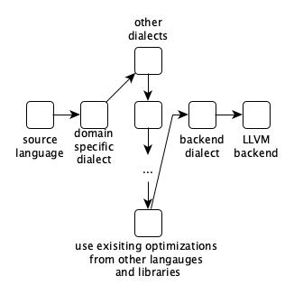

# MLIR

<!-- toc -->

---
I love jazz.
Of all the jazz styles I love, jazz fusion is the one I enjoy most, because I find any fusion of different things more stimulating.
Something especially interesting is happening at the intersection of programming language theory, compiler implementation, and applied cryptography.

But the thing with jazz fusion is that it's harder to get into unless you're familiar with the elements being combined.
Let me show you a few songs, and how we're mixing it up.
If you're familiar with one of these topics, bear with us, I promise it's worth it in the end.

Put on your seatbelts.
3, 2, 1...


## Intro beat

### Compilers & LLVM

Some 20-something years ago at the University of Illinois a group of compiler researchers had need of a more flexible infrastructure.
What they developed came to be known as LLVM and has since become the foremost compiler tooling project.
It powers many of the analysis and code generation components of the compilers for Clang, Swift, Rust, and many more languages.

From the 2004 CGO [paper](https://llvm.org/pubs/2004-01-30-CGO-LLVM.html) introducing it:

> The LLVM compiler framework and code representation together provide a combination of key capabilities that are important for practical, lifelong analysis and transformation of programs.

At the heart of LLVM is LLVM IR, it's Intermediate Representation.
IRs are essentially a combination of data formats and algorithms that allow best expressing the properties a tool wishes to guarantee or prove about code.

An example of this is the fact that LLVM IR is what's known as an SSA form, or Static Single Assignment, in which each variable will have a value assigned only once.
This allows the compiler to reason about it better than otherwise, it enables analysis and optimizations such as dead code elimination, constant propagation, constant folding, and facilitates other stages such as register allocation.

All this to say that IRs are a compiler writer's way of solving problems by building abstraction ladders, and LLVM became the de facto backend platform for modern compilers.

### Rise of AI

You may have become aware that machine learning algorithms and their applications are now a big deal.
The driver of many economic fortunes and solutions to problems we only dreamed of solving before, the statistical school of AI has settled (?) on a set of techniques which involve dealing with numerical operations on enormous matrices of numbers, and stringing together large numbers of these operations into computation graphs.
The fundamental elements in these computational graphs are things like matrix multiplications, convolutions, data manipulations and data movements.
This sounds very computationally expensive, and it is, and so the industry has (and is) going to great lengths to scale these approaches, make them cheaper and more effective on ever larger sets of data.

At some point a key observation was made: many of the problems these algorithms solve have inherent or given parallelism, and that we already had an industry producing machines specifically designed for embarassingly parallel numerical problems, namely shaders running on GPUs.
Thus the first wave of this effort was repurposing video graphics card hardware to make them applicable to this new area.

Why did we change the tune from LLVM to AI and graphics card? Because as they matured, these algorithms, models, techniques, tools, libraries were standarized into frameworks that could be used by many a layman programmer, and that required appropriate languages in which to express them, and their compilers.

Since LLVM had an IR that could, with some effort, be abstracted over GPU processors as well, it was used in tools such as PyTorch and Tensorflow to produce the code that would run on these graphical processing units.
New hardware was designed, and LLVM was again used to target these new tensor processing units.

As a result, Tensorflow has a number of compiler components embedded in it, made by different vendors: Google has XLA, NVIDIA has TensorRT, Intel has NGraph, all of which integrate with the Tensorflow optimizer and code generator and are very hardware specific, but do not share common infrastructure.


### Back to languages

In these intervening years since the early 2000s, the pendulum has swung back from dynamic to statically typed languages with more advanced type systems and code analysis phases.
LLVM enabled Clang, and then new languages such as Rust, Julia, and Swift.
Something these projects share in common is that they have found that many language implementation problems are best modeled at higher abstraction levels, and implemented their own intermediate representations to solve domain-specific problems, like language/library-specific optimizations, flow-sensitive type checking (e.g. for linear types), and to improve the implementation of the lowering process.
Swift has SIL, Rust has MIR, and so on.


In other words people started to realize that the complexity of the software stack above the low level IR was very high since software reuse was low and quality so variable.

After twenty years, expanding hardware targets, and changing problem spaces, LLVM was starting to be found lacking for certain areas.

## What (is MLIR?)


Out of this came [MLIR](https://mlir.llvm.org/) (Multi-Level Intermediate Representation), a project started by Chris Lattner et al with the aim to build a common infrastructure to support all these different subsystems, and to learn from the mistakes made and lessons learned in the development of LLVM.

I highly encourage you to read the introductory [paper](https://arxiv.org/pdf/2002.11054.pdf) from whence these graphics came, as it is very readable, or to listen to the [talk]() Lattner and Shpeisman gave presenting it.

> MLIR aims to address software fragmentation, improve compilation for heterogeneous hardware, significantly reduce the cost of building domain specific compilers, and aid in connecting existing compilers together.

There are several types of intermediate representations: linear (like assembly, a sequence of instructions), tree-like (like ASTs), graph-like (like data-flow or call-graphs).
As the project site states, "MLIR is intended to be a hybrid IR which can support multiple different requirements in a unified infrastructure."

Unlike LLVM IR where there is one central IR containing a complete set of instructions to represent the CPU/GPU programs in MLIR there is no one IR.

Rather, MLIR provides a set of very abstract concepts: dialects, operations, regions, etc.

From the [glossary](https://mlir.llvm.org/getting_started/Glossary/):

	> A dialect is a grouping of functionality which can be used to extend the MLIR system.
	> A dialect creates a unique namespace within which new operations, attributes, and types are defined.
	> This is the fundamental method by which to extend MLIR.
	> In this way, MLIR is a meta-IR: its extensible framework allows it to be leveraged in many different ways

An **operation** is unit of code in MLIR.
Operations are the building blocks for all code and computations represented by MLIR.
They are fully extensible (there is no fixed list of operations) and have application-specific semantics.

When implementing the code emitter, operations could map to procesor instructions.
When implementing an AST, nodes representing type conversions, function calls, language operands could be mapped to operations.

Operations can have an arbitrary number of operands, results, and attributes, and may contain an arbitrary number of regions.

A **region** is a control-flow-graph of MLIR blocks.

A **block**, or basic block, is a sequential list of operations without control flow.

Note that this creates a nested IR structure, as regions consist of blocks, which in turn, consist of a list of operations.
Regions are a powerful mechanism to allow nested operations and localize information, simplifying code analysis and transformation.

A **module** is an operation which contains a single region containing a single block that is comprised of operations, providing an organizational structure for MLIR operations.

MLIR allows for multiple dialects, even those outside of MLIR's codebase, to co-exist together within one module.

In the context of MLIR, conversion is distinct from translation.
The transformation of code represented in a dialect is called conversion, and can be either inter-dialect (when the conversion is into a semantically equivalent representation in another dialect) or intra-dialect, whereas translation refers to a transformation between MLIR and an external representation.

Thus an application using MLIR will typically use a collection of dialects as needed.

### What are the advantages over LLVM?

So you're writing a compiler, or need to add a backend to an existing compiler.
Aside from code reuse across the industry, what advantages does MLIR provide? Why would you choose it over LLVM?

To begin with, the choice is not that binary since MLIR include an LLVM IR dialect to which you can convert your application-specific dialect and thus leverage the existing LLVM toolchain.

MLIR also tries to provide universal patterns or passes that can just apply to suitable operations without hardcoding them.

So MLIR allows you to easily defined your own dialect, pick from a growing ecosystem of midle and low level dialects targeting different computation models, and integrate them into your own domain-specific compiler.

As [Lei Zhang](https://www.lei.chat/posts/compilers-and-irs-llvm-ir-spirv-and-mlir/) says:

> In other words, if LLVM IR is centralized by nature and favors unified compiler flows, the MLIR infrastructure and its dialect ecosystem is decentralized by nature and favors diverse compiler flows.
> What is quite powerful is that MLIR enables different levels to be represented using the same infrastructure; so that the flow between different levels can become seamless.

The UNIX way!



Other benefits include:
- Source code location tracking by default (each operand has a source code memory address attribute so errors directly point to the line of source code in which error occured)
- All functions run on multiple cores by default
- Optimizations done by other languages can be reused
- Reuse LLVM for machine code generation

Finally, if your domain does benefit from running all or some of your code in a GPU, TPU, or ASIC, MLIR provides a way to either reuse an existing dialect targeting that computation model and hardware by writing a conversion to it, and plugging in a code generator for final translation.

It includes dialects for SPIR-V, a general [GPU](https://mlir.llvm.org/docs/Dialects/GPU/) dialect and specific ones for [NVidia](https://mlir.llvm.org/docs/Dialects/NVGPU/) and [AMD](https://mlir.llvm.org/docs/Dialects/AMDGPU) GPUs.

All these advantages are direct results of MLIR's abstraction level.

## Why?

Let's change the tune again.

In the land of blockchains, cryptocurrencies, and distributed finance, several developments have converged:

First, the more established blockchains have paralleled the story in the machine learning world, offloading as much hashing as possible to GPUs and later ASICs (fating us mere mortals to scrabbling for the crumbs or resigned to playing emacs tetris on my Raspberry Pi).
Newer chains and L2s are expected to follow the same path.

Second, as their applications have become more mainstream (albeit with ups and downs), two concerns have taken center stage: scalability, and privacy.
Blockchains are not known for their efficiency so effort has gone into trying to have the best of both worlds; in part by moving away from Proof of Work, moving work to L2s, and also by turning back to guarantees provided by cryptographic techniques.
As new techniques have been discovered and older ones have matured, Zero Knowledge Proof systems have emerged as the predominant area from which solutions to these two problems can be built.

But as is well known, even though there is a good amount of gatekeeping, cryptography is not something one can pick up over the weekend and "roll one's own", especially in developing areas such as ZKP.
It's not _just_ that their proper use is difficult, or the fact that many components arestill in alpha, but because  translating computation in a programming language to a form that can be input to these cryptographic primitives takes a lot of work and some ingenuity.
Most ZKP protocols involve arithmetization, which is the process of representing computation in a numerical format that can be used by the proving system, usually by taking the instructions in the computation and building an expression graph of operations on bits called an arithmetic circuit, and then generating an _execution trace_, which very briefly is a matrix of field elements representing the evolution of the computation over time.
This execution trace is fed to the prover.

To encapsulate these processes virtual machines have been designed and implemented to generate these numerical execution traces and provide the computational guarantees, such as [Miden](https://github.com/0xPolygonMiden/miden-vm) and [cairo-rs](https://github.com/lambdaclass/cairo-rs/pulls).
Once you have a virtual machine, you need a compiler and an intermediate representation.

You also can't accept just any program since you need to know that it's execution is provable, unless you're willing to accept the possibility of nonterminating programs, invalid transactions which consume excessive gas, the production of invalid or incomplete traces, and having the prover just quit in the middle.
Type theory and intermediate representations within compilers  have become one of the strongest tools we have for producing code that has properties we can mechanically reason about and check.

So in short, the need to run on more diverse hardware, to incorporate programming language technology, to enable the easy use of difficult cryptographic primitives, to transport guarantees from developer tooling to execution layers, have all come together to bring about a small renaissance of language implementation in the crypto world.


CAIRO SIERRA


### Sierra Structure

So what does Sierra look like? 
We'll see some examples shortly. 
Briefly, Sierra is a linear intermediate representation. 
A sierra program consists of four sections: the types used in a particular program, the _libfuncs_ used, the program statements, and the descriptions of the user defined functions.

```rust
/// A full Sierra program.
#[derive(Clone, Debug, Eq, PartialEq)]
pub struct Program {
    /// Declarations for all the used types.
    pub type_declarations: Vec<TypeDeclaration>,
    /// Declarations for all the used library functions.
    pub libfunc_declarations: Vec<LibfuncDeclaration>,
    /// The code of the program.
    pub statements: Vec<Statement>,
    /// Descriptions of the functions - signatures and entry points.
    pub funcs: Vec<Function>,
}
```

Libfuncs (or library functions) are representation of calls to builtin functions whose implementations are vetted to be correct, then compiled to Cairo assembly. 
The built-in libfuncs implementation are generic and can be specialized as defined in the libfunc declaration section.

Statements can either invoke a libfunc or return a variable and are executed in sequence:

```rust
/// A possible statement.
#[derive(Clone, Debug, Eq, PartialEq)]
pub enum GenStatement<StatementId> {
    Invocation(GenInvocation<StatementId>),
    Return(Vec<VarId>),
}
```

User defined functions have an identifier, their type signature and parameters, and a statement identifier which marks the function entry point among the program statements. 

```rust
pub type Function = GenFunction<StatementIdx>;

/// Represents a function (its name, signature and entry point).
#[derive(Clone, Debug, Eq, PartialEq)]
pub struct GenFunction<StatementId> {
    /// The name of the function.
    pub id: FunctionId,
    /// The parameter types and return types.
    pub signature: FunctionSignature,
    /// The parameters of the function.
    pub params: Vec<Param>,
    /// The statement id where the function starts.
    pub entry_point: StatementId,
}
```

## How (does one use MLIR)?

In our application context, the Cairo & StarkNet software stack, most of it is transitioning to or being developed in Rust, so we would like to be able to integrate with this language that seamlessly.

MLIR comes with a [C-compatible API](https://mlir.llvm.org/docs/CAPI/, which can be easily interfaced with.
[mlir-sys](https://crates.io/crates/mlir-sys) provides auto-generated bindings to this interface, and [melior](https://crates.io/crates/melior-next) provides a somewhat more idiomatic wrapper around it.

MLIR as a library is part of the LLVM distribution, so if you have the latest LLVM as a system library, you will have access to MLIR.

Our project resides at [`github.com/lambdaclass/cairo_sierra2mlir`](https://github.com/lambdaclass/cairo_sierra2mlir).
You can find detailed setup instructions there that should leave you with a working development environment. When developing on Apple hardware, if you don't want to ~make~ compile your own, ~store-bought~ brew-provided LLVM system libraries are fine. 

Our first task is to parse the provided Sierra program.
Fortunately, the Cairo compiler libraries provide excellent functionality:

```rust
cairo_lang_sierra::ProgramParser::new()
            .parse(fs::read_to_string(input).unwrap().as_str())
            .unwrap(),
```

Once we have the Sierra representation in memory, we can start the translation process. 
Here is a high-level overview:


The first step is initializing our machinery. 
We need to reate our own dialect and a context and register them. A context contains IR, dialects, and passes, and owns various objects, such as types, locations, and dialect instances.

```rust
let registry = dialect::Registry::new();
register_all_dialects(&registry);
let context = Context::new();
context.append_dialect_registry(&registry);
context.load_all_available_dialects();
register_all_llvm_translations(&context);
```

We also need to create a region with a block for the builtin module:
```rust
let location = Location::unknown(&context);
let region = Region::new();
let block = Block::new(&[]);
region.append_block(block);
let module_op = operation::Builder::new("builtin.module", location)
    .add_regions(vec![region])
    .build();
let module = Module::from_operation(module_op).unwrap();
```

Once initialization is done, we can start the process of converting by processing, in sequence: types, libfuncs, functions, and statements. We won't go into full detail but we can take a look at an interesting example short enough to inspect its transformation process: a program performing addition and substraction of field elements, and see how libfuncs are processed. 

For every function declaration in the libfunc declaration section of our Sierra program, the libfunc name will be matched and execution of compilation dispatched to the appropriate Rust function.

This simple function takes a Felt (a 252-bit Field Element) and returns a struct with two values:

```cairo
fn something(a: felt252) -> (felt252, felt252) {
    (a + 2, a - 2)
}
```

The cairo compiler outputs the following Sierra:

```sierra
type felt252 = felt252;
type Tuple<felt252, felt252> = Struct<ut@Tuple, felt252, felt252>;

libfunc felt252_const<2> = felt252_const<2>;
libfunc dup<felt252> = dup<felt252>;
libfunc felt252_add = felt252_add;
libfunc felt252_sub = felt252_sub;
libfunc struct_construct<Tuple<felt252, felt252>> = struct_construct<Tuple<felt252, felt252>>;
libfunc store_temp<Tuple<felt252, felt252>> = store_temp<Tuple<felt252, felt252>>;

felt252_const<2>() -> ([1]);
dup<felt252>([0]) -> ([0], [3]);
felt252_add([3], [1]) -> ([2]);
felt252_const<2>() -> ([4]);
felt252_sub([0], [4]) -> ([5]);
struct_construct<Tuple<felt252, felt252>>([2], [5]) -> ([6]);
store_temp<Tuple<felt252, felt252>>([6]) -> ([7]);
return([7]);

simple::simple::something@0([0]: felt252) -> (Tuple<felt252, felt252>);
```

Despite being quite low-level, it is still readable:
- declare a felt constant with value 2 into memory cell 1
- duplicate the value in memory cell 0 into cell 3
- add the value in memory cell 1 to the one in cell 3 and put the result in cell 2
- declare a felt constant with value 2 into memory cell 4
- substract the value in memory cell 4 from the value in cell 0, and put the result in cell 5
- construct a tuple of type `<felt252, felt252>` with values fom cell 2 and 5, and put it in cell 6
- store this value in cell 7 in preparation for returning it
- return the value in cell 7

The meat in this simple example is obviously the "`felt252_add`" libfunc which implements addition for field elements. 
Let's see how this is implemented in our MLIR dialect:

We'll need a region with several blocks, one in which the calculation occurs, another in which we'll return values that result in numbers greater or equal than the field prime, and another for returning values lesser than the field prime. 
We obtain the arguments, perform the addition, and check the result against the field prime. 

This condition is represented by the `op_cond_br` conditional branch operation from the MLIR `cf` dialect, which 

> ... contains low-level, i.e. non-region based, control flow constructs. 
> These constructs generally represent control flow directly on SSA blocks of a control flow graph.
> The cond_br terminator operation represents a conditional branch on a boolean (1-bit integer) value. If the bit is set, then the first destination is jumped to; if it is false, the second destination is chosen.

In our case, due to how addition works in the field, if the result is greater than the field prime we can simply substract the prime value to wrap around. In other words, if the result is greater, jump to the `gte_prime_block` or "greater than prime block", and if not, jump to the `in_range_block`.

```rust
    pub fn create_libfunc_felt_add(
        &'ctx self,
        func_decl: &LibfuncDeclaration,
        parent_block: BlockRef<'ctx>,
        storage: &mut Storage<'ctx>,
    ) -> Result<()> {
        let id = func_decl.id.debug_name.as_ref().unwrap().to_string();
        let sierra_felt_type = SierraType::Simple(self.felt_type());
        let felt_type = sierra_felt_type.get_type();
        let felt_type_location = sierra_felt_type.get_type_location(&self.context);

        let region = Region::new();
        // Block in which the calculation occurs
        let entry_block = Block::new(&[felt_type_location, felt_type_location]);
        // Block for wrapping values >= PRIME
        let gte_prime_block = Block::new(&[]);
        // Block for returning values < PRIME
        let in_range_block = Block::new(&[]);

        // res = lhs + rhs
        let lhs = entry_block.argument(0)?.into();
        let rhs = entry_block.argument(1)?.into();
        let res_op = self.op_add(&entry_block, lhs, rhs);
        let res = res_op.result(0)?.into();

        // gt_prime <=> res_result >= PRIME
        let prime_op = self.prime_constant(&entry_block);
        let prime = prime_op.result(0)?.into();
        let gte_prime_op = self.op_cmp(&entry_block, CmpOp::UnsignedGreaterThanEqual, res, prime);
        let gte_prime = gte_prime_op.result(0)?.into();

        // if gt_prime
        self.op_cond_br(&entry_block, gte_prime, &gte_prime_block, &in_range_block, &[], &[]);

        // gt prime block
        let wrapped_res_op = self.op_sub(&gte_prime_block, res, prime);
        let wrapped_res = wrapped_res_op.result(0)?.into();
        self.op_return(&gte_prime_block, &[wrapped_res]);

        // in range block
        self.op_return(&in_range_block, &[res]);

        region.append_block(entry_block);
        region.append_block(in_range_block);
        region.append_block(gte_prime_block);
        let func = self.op_func(
            &id,
            &create_fn_signature(&[felt_type, felt_type], &[felt_type]),
            vec![region],
            FnAttributes::libfunc(false, true),
        )?;

        parent_block.append_operation(func);
        storage.libfuncs.insert(
            id,
            SierraLibFunc::create_function_all_args(
                vec![sierra_felt_type.clone(), sierra_felt_type.clone()],
                vec![sierra_felt_type],
            ),
        );
        Ok(())
    }

```

This is the MLIR corresponding to the felt252_add libfunc:
```mlir
  func.func @felt252_add(%arg0: i256, %arg1: i256) -> i256 attributes {llvm.dso_local, llvm.linkage = #llvm.linkage<internal>, passthrough = ["norecurse", "alwaysinline", "nounwind"]} {
    %0 = arith.addi %arg0, %arg1 : i256
    %c3618502788666131213697322783095070105623107215331596699973092056135872020481_i256 = arith.constant 3618502788666131213697322783095070105623107215331596699973092056135872020481 : i256
    %1 = arith.cmpi uge, %0, %c3618502788666131213697322783095070105623107215331596699973092056135872020481_i256 : i256
    cf.cond_br %1, ^bb2, ^bb1
  ^bb1:  // pred: ^bb0
    return %0 : i256
  ^bb2:  // pred: ^bb0
    %2 = arith.subi %0, %c3618502788666131213697322783095070105623107215331596699973092056135872020481_i256 : i256
    return %2 : i256
  }
```

As you can see, we have three basic blocks, and the last instruction of the first is a conditional jump.

This is the entire resulting MLIR before going the registered passes:

```mlir
module {
  func.func @felt252_add(%arg0: i256, %arg1: i256) -> i256 attributes {llvm.dso_local, llvm.linkage = #llvm.linkage<internal>, passthrough = ["norecurse", "alwaysinline", "nounwind"]} {
    %0 = arith.addi %arg0, %arg1 : i256
    %c3618502788666131213697322783095070105623107215331596699973092056135872020481_i256 = arith.constant 3618502788666131213697322783095070105623107215331596699973092056135872020481 : i256
    %1 = arith.cmpi uge, %0, %c3618502788666131213697322783095070105623107215331596699973092056135872020481_i256 : i256
    cf.cond_br %1, ^bb2, ^bb1
  ^bb1:  // pred: ^bb0
    return %0 : i256
  ^bb2:  // pred: ^bb0
    %2 = arith.subi %0, %c3618502788666131213697322783095070105623107215331596699973092056135872020481_i256 : i256
    return %2 : i256
  }
  func.func @felt252_sub(%arg0: i256, %arg1: i256) -> i256 attributes {llvm.dso_local, llvm.linkage = #llvm.linkage<internal>, passthrough = ["norecurse", "alwaysinline", "nounwind"]} {
    %0 = arith.subi %arg0, %arg1 : i256
    %c0_i256 = arith.constant 0 : i256
    %1 = arith.cmpi slt, %0, %c0_i256 : i256
    cf.cond_br %1, ^bb2, ^bb1
  ^bb1:  // pred: ^bb0
    return %0 : i256
  ^bb2:  // pred: ^bb0
    %c3618502788666131213697322783095070105623107215331596699973092056135872020481_i256 = arith.constant 3618502788666131213697322783095070105623107215331596699973092056135872020481 : i256
    %2 = arith.addi %0, %c3618502788666131213697322783095070105623107215331596699973092056135872020481_i256 : i256
    return %2 : i256
  }
  func.func @"struct_construct<Tuple<felt252, felt252>>"(%arg0: i256, %arg1: i256) -> !llvm.struct<packed (i256, i256)> attributes {llvm.dso_local, llvm.linkage = #llvm.linkage<internal>, passthrough = ["norecurse", "alwaysinline", "nounwind"]} {
    %0 = llvm.mlir.undef : !llvm.struct<packed (i256, i256)>
    %1 = llvm.insertvalue %arg0, %0[0] : !llvm.struct<packed (i256, i256)>
    %2 = llvm.insertvalue %arg1, %1[1] : !llvm.struct<packed (i256, i256)>
    return %2 : !llvm.struct<packed (i256, i256)>
  }
  func.func @"simple::simple::something"(%arg0: i256) -> !llvm.struct<packed (i256, i256)> attributes {llvm.dso_local, llvm.emit_c_interface} {
    cf.br ^bb1(%arg0 : i256)
  ^bb1(%0: i256):  // pred: ^bb0
    %c2_i256 = arith.constant 2 : i256
    %1 = call @felt252_add(%0, %c2_i256) : (i256, i256) -> i256
    %c2_i256_0 = arith.constant 2 : i256
    %2 = call @felt252_sub(%0, %c2_i256_0) : (i256, i256) -> i256
    %3 = call @"struct_construct<Tuple<felt252, felt252>>"(%1, %2) : (i256, i256) -> !llvm.struct<packed (i256, i256)>
    return %3 : !llvm.struct<packed (i256, i256)>
  }
}
```

Great, so we have converted Sierra to MLIR using several builtin dialects and our own.
To be able to run our code, we need to lower it to something that can be run.
An excellent choice for now is LLVM IR, since we want to run our Cairo code as native CPU instructions, and can use the very solid LLVM infrastructure to compile LLVM IR to a binary object. 
We also want to leverage MLIR and LLVM's pass manager infrastructure to take advantage of the optimizations it provides.

We create a pass manager and add the passes we want our code to go through:

```rust
    let pass_manager = pass::Manager::new(&compiler.context);
    register_all_passes();
    pass_manager.add_pass(pass::conversion::convert_func_to_llvm());
    pass_manager.add_pass(pass::conversion::convert_scf_to_cf());
    pass_manager.add_pass(pass::conversion::convert_cf_to_llvm());
    pass_manager.add_pass(pass::conversion::convert_arithmetic_to_llvm());
    pass_manager.add_pass(pass::conversion::convert_index_to_llvm());
    pass_manager.add_pass(pass::conversion::convert_math_to_llvm());
    pass_manager.add_pass(pass::conversion::convert_memref_to_llvmconversion_pass());
    pass_manager.add_pass(pass::conversion::convert_reconcile_unrealized_casts());
    if optimized {
        pass_manager.add_pass(pass::transform::canonicalizer());
        pass_manager.add_pass(pass::transform::inliner());
        pass_manager.add_pass(pass::transform::symbol_dce());
        pass_manager.add_pass(pass::transform::cse());
        pass_manager.add_pass(pass::transform::sccp());
    }
    pass_manager.enable_verifier(true);
    pass_manager.run(&mut compiler.module)?;

    let op = compiler.module.as_operation();
    if op.verify() {
        if debug_info {
            Ok(op.debug_print())
        } else {
            Ok(op.to_string())
        }
    } else {
        Err(color_eyre::eyre::eyre!("error verifying"))
    }
}
```

What do these passes do?
- convert_func_to_llvm`: converts the `func` dialect, which contains operations surrounding high order function abstractions, such as calls, to the `llvm` dialect, which maps LLVM IR into MLIR by defining the corresponding operations and types.
- `convert_scf_to_cf`: converts the `scf` (Structured Control Flow, with loops and ifs) dialect, ,  to the `cf` (Control Flow) dialect, replacing structured control flow with a CFG. In LLVM, you have to analyze branches to detect loops. SCF is at higher abstraction.
- `convert_cf_to_llvm`: converts the `cf` dialect to the `llvm` dialect. 
- `convert_arithmetic_to_llvm`: converts the `arith` dialect (which holds basic integer and floating point mathematical operations) to the `llvm` dialect.
- `convert_math_to_llvm`: converts the `math` dialect (which holds mathematical operations on integer and floating types beyond simple arithmetics) to the `llvm` dialect. 
- `convert_index_to_llvm`: converts the `index` dialect (which contains operations for manipulating values of the builtin index type) to the `llvm` dialect.
- `convert_memref_to_llvmconversion_pass`: The `memref` dialect is intended to hold core memref creation and manipulation ops, which are not strongly associated with any particular other dialect or domain abstraction.
- `convert_reconcile_unrealized_casts`: this pass simplifies and eliminates unrealized conversion cast operations, commonly introduced by partial dialect conversions, that transitively convert a value to another value of the same type. 

The optimization passes we will apply are:
- `canonicalizer`: Canonicalize operations. This pass performs various types of canonicalizations over a set of operations by iteratively applying the canonicalization patterns of all loaded dialects until either a fixpoint is reached or the maximum number of iterations/rewrites is exhausted. Canonicalization is an important part of compiler IR design: it makes it easier to implement reliable compiler transformations and to reason about what is better or worse in the code, and it forces interesting discussions about the goals of a particular level of IR. Most compilers have canonicalization passes, and sometimes they have many different ones (e.g. instcombine, dag combine, etc in LLVM). Because MLIR is a multi-level IR, it can provide a single canonicalization infrastructure and reuse it across many different IRs that it represents. 
- `inliner`: the inliner pass inlines function calls.
- `symbol_dce`: this pass deletes all symbols that are found to be unreachable. 
- `cse`: this pass implements a generalized algorithm for common sub-expression elimination. 
- `sccp`: this pass implements a general algorithm for sparse conditional constant propagation. This algorithm detects values that are known to be constant and optimistically propagates this throughout the IR. Any values proven to be constant are replaced, and removed if possible.

#### Execution

We now have an in-memory representation of our program in optimized MLIR. How can we execute our code?

MLIR provides an ExecutionEngine, which takes a module and expects it to be translatable to LLVM IR, and then uses the LLVM JIT ExecutionEngine to compile and run it. 
The engine must also know the entry point for execution, and the following example is from a benchmark of the fibonacci function: 

```rust
let program = ProgramParser::new().parse(include_str!("programs/fib.sierra")).unwrap();

let engine = ExecutionEngine::new(
    &compiler.module,
    2,
    &[
        &format!(
            "{}/libmlir_c_runner_utils.{}",
            run_llvm_config(&["--libdir"]).trim(),
            env!("SHARED_LIB_EXT"),
        ),
        env!("S2M_UTILS_PATH"),
    ],
    false,
);

unsafe {
    engine.invoke_packed("fib::fib::main", &mut []).unwrap();
};
```

## Conclusions

As said, MLIR is a young project.
Although there is a healthy number of case studies and [users](https://mlir.llvm.org/users/), enough to look at the sunset sky and muse "this is the way", there are a few caveats.

First, although it is clear that the project has made an effort, documentation is scarce.
The API is documented and there are great getting started tutorials, but if you stray off the signalled path, you end up looking at test code, other projects, and trial and error.

Second, the project is written in C++.
It provides a C-compatible API with which to fashion bindigs in your language, but it is under development and unstable.
The Python bindings are also under development and not enabled by default.
The Rust bindings are somewhat auto-generated and not very mature.
You may end up having to build some tools to build this tool to build the tool you want to ship, also known as yak shaving of an especially hairy breed.

Third, like any powerful tool that allows one to operate on a high level of abstraction, it requires you to be able to bridge abstraction layers and truly understand your goals and the obstacles you face in reaching them.
Knowledge of compiler technology and the techniques and vocabulary involved is a must.
Perhaps with more maturity other tools will be able to be fashioned which can hide complexity for more specific domains.

We would like to salute and thank the team and community behind LLVM and MLIR, and Cairo.
Foundational technologies are rare, difficult to develop, and require great insight and vision to come to term.
These stones feel as the base on which great things will rest.


## References and Resources

- [MLIR Homepage](https://mlir.llvm.org/)
- 2019 EuroLLVM Developers’ Meeting: T. Shpeisman & C. Lattner “MLIR: Multi-Level Intermediate Representation Compiler Infrastructure” [Video](https://www.youtube.com/watch?v=qzljG6DKgic) and [Slides](https://llvm.org/devmtg/2019-04/slides/Keynote-ShpeismanLattner-MLIR.pdf)
- MLIR Tutorial [Video](https://www.youtube.com/watch?v=Y4SvqTtOIDk) and [Slides](https://llvm.org/devmtg/2020-09/slides/MLIR_Tutorial.pdf)
- [Yizhou Shan's notes on MLIR](http://lastweek.io/notes/MLIR/)
- [Lei Zhang's "Compilers and IRs: LLVM IR, SPIR-V, and MLIR"](https://www.lei.chat/posts/compilers-and-irs-llvm-ir-spirv-and-mlir/)
- [Starkware glossary: STARKs, StarkEx, and StarkNet](https://medium.com/starkware/starks-starkex-and-starknet-9a426680745a)
- [Starkware: Cairo 1.0](https://medium.com/starkware/cairo-1-0-aa96eefb19a0)
- [Starkware: Cairo 1.0 is here](https://medium.com/starkware/cairo-1-0-is-here-7e1ac8377038)
