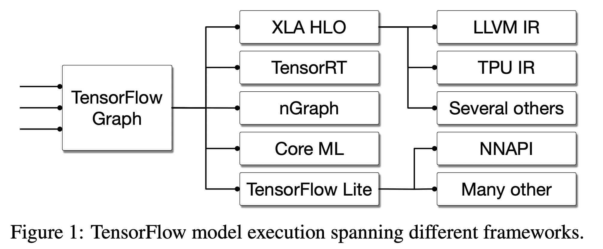

# MLIR

<!-- toc -->

structure:

- INTRO: the lead up to MLIR:
	- LLVM background
	- Then machine learning algos with HW acceleleration
	- Compiler infra proliferation, duplication
	- LLVM unsuitability
- WHAT
	- Enter MLIR
	- So what is MLIR?
- WHY
	- Advantages over LLVM
		- Running on GPU
	- Meanwhile in cryptoland
		- Goals
		- HW accelerated crypto, GPU, ASIC future
	-  Why (use MLIR in the context of Cairo)?
- HOW
	- sierra2mlir compilation process
	- how to run emitted code
	- example: felt add
	- example: conditional
- BUT
- CONCLUSION

---
I love jazz. Of all the jazz styles I love, jazz fusion is the one I enjoy most, because I find any fusion of different things more stimulating.
Something especially interesting is happening at the intersection of programming language theory, compiler implementation, and applied cryptography.

But the thing with jazz fusion is that it's harder to get into unless you're familiar with the elements being combined. Let me show you a few songs, and how we're mixing it up. 

Put on your seatbelts. 3, 2, 1... 


## Intro beat

### Compilers, LLVM

Some 20-something years ago at the University of Illinois a group of compiler researchers had need of a more flexible infrastructure. What they developed came to be known as LLVM and has since become the foremost compiler tooling project. It powers many of the analysis and code generation components of the compilers for Clang, Swift, Rust, and many more languages.

From the 2004 CGO [paper](https://llvm.org/pubs/2004-01-30-CGO-LLVM.html) introducing it: 

> The LLVM compiler framework and code representation together provide a combination of key capabilities that are important for practical, lifelong analysis and transformation of programs. 

At the heart of LLVM is LLVM IR, it's Intermediate Representation. IRs are essentially a combination of data formats and algorithms that allow best expressing the properties a tool wishes to guarantee or prove about code.

An example of this is the fact that LLVM IR is what's known as an SSA form, or Static Single Assignment, in which each variable will have a value assigned only once. This allows the compiler to reason about it better than otherwise, it enables analysis and optimizations such as dead code elimination, constant propagation, constant folding, and facilitates other stages such as register allocation.  

All this to say that IRs are a compiler writer's way of solving problems by building abstraction ladders, and LLVM became the de facto backend platform for modern compilers.

### Rise of AI

You may have become aware that machine learning algorithms and their applications are now a big deal. The driver of many economic fortunes and solutions to problems we only dreamed of solving before, the statistical school of AI has settled (?) on a set of techniques which involve dealing with numerical operations on enormous matrices of numbers, and stringing together large numbers of these operations into computation graphs. The fundamental elements in these computational graphs are things like matrix multiplications, convolutions, data manipulations and data movements. This sounds very computationally expensive, and it is, and so the industry has (and is) going to great lengths to scale these approaches, make them cheaper and more effective on ever larger sets of data. 

At some point a key observation was made: many of the problems these algorithms solve have inherent or given parallelism, and that we already had an industry producing machines specifically designed for embarassingly parallel numerical problems, namely shaders running on GPUs. Thus the first wave of this effort was repurposing video graphics card hardware to make them applicable to this new area.

Why did we change the tune from LLVM to AI and graphics card? Because as they matured, these algorithms, models, techniques, tools, libraries were standarized into frameworks that could be used by many a layman programmer, and that required appropriate languages in which to express them, and their compilers. 

Since LLVM had an IR that could, with some effort, be abstracted over GPU processors as well, it was used in tools such as PyTorch and Tensorflow to produce the code that would run on these graphical processing units. 
New hardware was designed, and LLVM was again used to target these new tensor processing units.

As a result, Tensorflow has a number of compiler components embedded in it, made by different vendors: Google has XLA, NVIDIA has TensorRT, Intel has NGraph, all of which integrate with the Tensorflow optimizer and code generator and are very hardware specific, but do not share common infrastructure. 



### Back to languages

In these intervening years since the early 2000s, the pendulum has swung back from dynamic to staticly typed languages with more advanced type systems and code analysis phases. LLVM enabled Clang, and then new languages such as Rust, Julia, and Swift. Something these projects share in common is that they have found that many language implementation problems are best modeled at higher abstraction levels, and implemented their own intermediate representations to solve domain-specific problems, like language/library-specific optimizations, flow-sensitive type checking (e.g. for linear types), and to improve the implementation of the lowering process. Swift has SIL, Rust has MIR, and so on.


In other words people started to realize that the complexity of the software stack above the low level IR was very high since software reuse was low and quality so variable. 

After twenty years, expanding hardware targets, and changing problem spaces, LLVM was starting to be found lacking for certain areas.

## What? (is MLIR?)


Out of this came [MLIR](https://mlir.llvm.org/) (Multi-Level Intermediate Representation), a project started by Chris Lattner et al with the aim to build a common infrastructure to support all these different subsystems, and to learn from the mistakes made and lessons learned in the development of LLVM. 

I highly encourage you to read the introductory [paper](https://arxiv.org/pdf/2002.11054.pdf) from whence these imags came, as it is very readable, or to listen to the talk Lattner and Shpeisman gave presenting it. 

> MLIR aims to address software fragmentation, improve compilation for heterogeneous hardware, significantly reduce the cost of building domain specific compilers, and aid in connecting existing compilers together.

There are several types of intermediate representations: linear (like assembly, a sequence of instructions), tree-like (like ASTs), graph-like (like data-flow or call-graphs). As the project site states, "MLIR is intended to be a hybrid IR which can support multiple different requirements in a unified infrastructure."

### What are is advantages over LLVM?

So aside from code reuse across the industry, what advantages does MLIR provide?

- Source code location tracking by default
- All functions run on multiple cores by default (uses OpenMP)
- Better code reuse for compiler stack (for new library and hardware) and hence, optimizations done by other languages can be reused
- Intermediate IR to capture data flow information and apply optimizations, better source code tracking than LLVM, flexible design, Reuse LLVM for Machine code generation

> Ref: opengenus

> Within MLIR, we can implement multiple Dialects for distinct inputs. For instance, we could use a Dialect to deal with tensors. Further, we can deploy a shared optimization layer to unify things. Once we have an optimal IR, MLIR can now lower it onto the backends such as LLVM for CPUs, CIRCT for FPGAs. If you are targeting specialized hardware such as FPGA or TPU, you still need vendor-tools for final compilation (e.g., use Vivado to synthesis Verilog). 

> MLIR is something that lies across language AST and LLVM IR.

> Ref: The other side of the coin

	LLVM is a great leap forward to compiler development. With its good designs and the effort of a vigorous open-source community, we have seen so many great tools come into existence and improve developer productivity. However, it is said that every coin has two sides. Now with the existing LLVM ecosystem as the basis, there are shades casted by the design tradeoffs that become more and more obvious.
	
	Centralization and forks, forks, forks

	LLVM IR is centric to the whole LLVM ecosystem. That is the foundation to the great decoupling of frontend and backend. However, it also means a full flow must pass through via LLVM IR.

	Changing LLVM IR itself needs to meet a very lofty bar nowadays because of its nature of center of gravity. All the tools are expected to process it, and there are so many transformations and different organizations' workflows go through it. Even if you don’t need to plumb through the full flow that frequency, tweaking a small aspect of the IR can still trigger a surprising ripple effect. So that naturally means changes are slow and requires extensive discussions and sign offs from many stakeholders. That is all necessary to guarantee the quality of LLVM IR; but if I just have a very isolated need, it would be quite hard to motivate a change and justify its landing.

	One way, and also the typical way actually, is just to fork LLVM and keep the modification local. But that has a high cost too. LLVM IR being centric really favors upstreaming as much as possible. There are almost 100 commits lands per day in the monorepo, bringing various new features and bug fixes. If not merging consistently, it risks divergence more and more and then it eventually becomes unmanageable, unless staleness is fine. On the other hand, consistently catching up with upstream would mean dedicated teams and engineering efforts.

	So the end result is that we have many different flavors of LLVM forks at different versions or commits, with varying degrees of freshness. Maintaining and updating those forks certainly take a significant amount of engineering effort if taken globally.

	Though it’s hard to say the problem is unique to LLVM; large and complex systems that are developed by open-source communities and productionzied by various organizations have similar problems. However, those projects typically expect customization of some sorts; in contrast, LLVM IR’s absolute centric role makes it hard. In a sense, it’s a strong coupling. MLIR goes another step towards decoupling the IR.
	Evolution and compatibility

	Another LLVM IR’s design choice is to co-evolve the IR with various analysis and transformations. This is crucial for better and better toolchains. But it does mean weak compatibility guarantees. The community will try to maintain compatibility as much as possible, but the ability to make breaking changes are certainly reserved.

	Compilers typically operate at a level that is close to the operating system and hardware device. So it’s quite natural that people leverage LLVM IR as the program representation to device drivers, especially given the great ecosystem and the fact that LLVM IR has a bytecode form!

	However, using LLVM IR as the representation to flow through a coherent set of software and tools is the well supported path; if hardware and devices are involved, it’s a different story. Hardware devices may be in some end product (e.g., a cell phone) and thus controlled by the device manufacturer and end consumer; so there is no guarantee when the driver, which contains LLVM libraries to consume LLVM IR, will be updated, if ever.

	There are quite a few attempts of using LLVM IR this way, with mixed success. A notable example is Standard Portable Intermediate Representation (SPIR). SPIR was meant to represent OpenCL kernels. It is LLVM IR pinned at specific versions, with OpenCL compute constructs defined as LLVM intrinsics and metadata. Over the years, the Khronos Group gradually realized that LLVM IR is not really designed for this kind of task, which led to the birth of SPIR-V.

	MLIR

	MLIR landed in the LLVM monorepo at the end of 2019. So it’s just 2 years old. My feeling is that it takes at least 5 years to see a reasonably mature ecosystem. So in that sense, MLIR is still very young and there is lots of development to happen. But still, MLIR is already bringing many novel ideas or profound changes to compilers, notably infrastructurization to further decouple compilers and IRs.
	
	Infrastructurization

	Infrastructurization is a natural endpoint for technology evolution. Being a part of the infrastructure means the solution is mature enough and widely deployed. Based on that, the next technology evolution can then happen. We see this for transportation, electricity, internet, public cloud, and so on. Those are massive ones for sure; it also happens for smaller scaled technology, because it helps to share the cost of developing infrastructure and let each other focus on core business logic.

	Many people get to know about MLIR as one way to implement machine learning compilers. Serving the ML domain and power ML compilers is indeed the initial application and still one important role for MLIR; but MLIR is much more than that.

	MLIR is a compiler infrastructure that aims to provide reusable and extensible fundamental components to facilitate building domain specific compilers. Unlike LLVM IR or SPIR-V, where we have one central IR containing a complete set of instructions to represent the CPU/GPU programs they aim to compile, in MLIR, there is no one IR that is clearly at the center.

	What MLIR provides is just infrastructure to define operations (instructions in the broader sense) and form logical groups of them (called dialects in MLIR) based on functionality. MLIR also tries to provide universal patterns or passes that can just apply to suitable operations without hardcoding them.

	Both goals require MLIR to look at compilers in a more fine-grained manner to decompose concepts further. Instead of seeing operations at the atom, as an infrastructure, the granularity goes down to types, values, attributes, regions, and interfaces (like attribute/type/operation interfaces).

	Operations can have an arbitrary number of operands, results, and attributes, and may contain an arbitrary number of regions. Region is a powerful mechanism to allow nested levels of operations and make information localized, which simplifies analysis and transformation. Operations also implement certain interfaces. That allows patterns and passes to be written to operate on interfaces, so detached from concrete operations.

	All concepts in MLIR are abstract and detached by design, in order to map to various domains and use cases.
	Dialects, dialects, dialects

	But the purpose of an infrastructure is to help build products (here, domain specific compilers). We program C++ by calling into STL or even higher level libraries. Rarely one would write everything from scratch. Also infrastructure also needs to co-evolve with its products, as there are where the needs come. So in MLIR, there are also in-tree dialects for abstractions at different levels. They are like STL to C++.

	MLIR’s dialect ecosystem is still in its organically growing phase, but there are already early signs of stability and maturity. For example, we have both LLVM and SPIR-V as edge dialects to convert to/from IRs in other systems. (This fact alone actually signifies that MLIR is really an infrastructure as it’s able to define other IRs entirely!) We have middle level abstractions like Linalg, Tensor, Vector, SCF for structured code generation. We have Affine, Math, Arithmetic for low level computation. AI framework dialects like TensorFlow, TFLite, MHLO, Torch, TOSA for importing ML model graphs into MLIR. And many others.

	Alex posted an awesome graph and discussions of different dialects in MLIR, which is well worth a read if you are interested. I’ll also write up my understanding of the dialect ecosystem later. These dialects (and eventually partial or full flows connecting and wrapping them) will make developing domain-specific compilers much more simpler.
	Further unbundling compilers and IRs

	The infrastructurization and plethora of dialects are actually another step towards decoupling and modularizing both compilers and IRs.

	Instead of one single central IR, now we have many reusable “partial” IRs that are logically organized into MLIR dialects. If those readily available ones aren’t satisfying your needs, defining new ones and writing their validations are also very easy with the declarative op definition. So given a few more years for MLIR to mature further, we can imagine a world where developing domain-specific compilers means just defining the edge dialect for project specific operations, and picking existing middle or low level dialects and chain them together to form a full flow! This certainly takes much less effort than building everything from the ground up.

	Also, the decoupling gives us the flexibility to make tradeoffs based on the specific needs of the domain. We can choose only the necessary partial IRs to piece together a full-fledged compiler; we are not required to pick up a full IR like LLVM IR in its entirety with all its complexity. Extending the functionality of existing components is also simpler given that interfaces are what connects operations and patterns/passes. We can both define new ops implementing existing interfaces to make patterns and passes work immediately, or actually attach new interfaces to existing operations to make them support external patterns and passes.

	In other words, if LLVM IR is centralized by nature and favors unified compiler flows, the MLIR infrastructure and its dialect ecosystem is decentralized by nature and favors diverse compiler flows.

	The typical trend of technology is evolving from single monolithic options to abundant diverse choices. It’s especially the case for upper layers, because there we are more close to the concrete business needs, which is diverse by nature. For example, think of how many web frontend frameworks, distributed data processing frameworks, ML frameworks we have.

	For lower layers, it has been quite stable; we just have the few main hardware architectures, compilers, and operating systems. But the slow down of semiconductor advancement and the ever-growing computation need are driving changes here too. It’s hard to still only rely on general architectures and optimize towards all domains. Developing domain-specific end-to-end solutions is an interesting way out. We see RISC-V pioneering customization and modularization at the ISA level; MLIR is effectively customizing and modularizing the compilers and IRs. It would be very interesting to see how they can work together to push the frontier for low tech layers.
	Progressive lowering across system boundaries

	There is another aspect I’d like to touch on before closing this section. There are two dimensions that we can look at the unbundling that is brought by MLIR:

	Horizontally, dialects split a complete IR into separate partial IRs at the same level, e.g., scalar operations, vector operation, control flow operations, etc. Vertically, MLIR enables dialects and operations to model concepts at different abstraction levels.

	This is very useful for domain-specific compilers, which typically have a very high-level source program that describes the job in a declarative way and needs to be compiled down to imperative machine code. Going in one step is unmanageable. Performing progressive lowering with multiple levels of abstractions is preferable, because it separates concerns and lets each layer focus on one dedicated task. Again, decoupling is the key to make complex systems tractable.

	But this isn’t entirely new for sure, as we have IR-like constructs in various projects for a long time, like Clang AST and ML framework graphs. What is quite powerful is that MLIR enables different levels to be represented using the same infrastructure; so that the flow between different levels can become seamless.

	One of the major tasks in developing modern complex systems is actually choosing various subsystems and chain them together. The boundaries between subsystems place rigid barriers. Much of the efforts are spent taking the output from a previous subsystem, verifying, mutating, and then feeding into a next one. Now if all the systems use the same internal representation and infrastructure, it would save that effort entirely. What’s more, it would also make cross-team cross-project collaboration easier because of the same mindset and tools!

	Closing Words

	LLVM decoupled and modularized compilers with LLVM IR and libraries. It also brings the UNIX simplicity to compilers with textural forms. However, certain design choices in LLVM IR makes it not suitable for certain domains, e.g., it does not have a hard guarantee over stability and compatibility, and LLVM IR itself is a monolithic central IR.

	MLIR decouples compilers and IRs further by breaking down monolithic IRs into mixable dialects. Its infrastructure unleashes the power of defining and converting abstractions at different levels with ease. This matches the general direction of going from monolithic to more and more modular and let each domain have their customized solutions with their own tradeoffs. Hopefully writing domain-specific compilers could be as easy as choosing, customizing, and mixing open dialects in the future!

### Running on GPU

```	
	In terms of evolution, using LLVM for GPU compilation will require moving away from LLVM IR itself, I think. The tradeoffs and semantics start diverging quickly, and even different GPU-based IRs may/will have slightly different semantics. So, a container IR would be ideal to allow different middle/back-ends express their own semantic needs. Do you see MLIR as that container IR? How would different backends use MLIR to further describe their semantics (say SPIRV vs DXIL vs CUDA).

	I think MLIR can be the infrastructure for such purposes. It provides a consistent infra and scaffolding for different variants of GPU IRs. What op and what semantics to have is up to each GPU IR to define. Actually as of right now we already have multiple GPU related dialects, GPU dialect being vendor-agonistic common host/device abstractions, NVGPU dialect/AMDGPU dialect for NVIDIA/AMD-specific stuff, SPIR-V dialect for lowering and existing MLIR system, etc.

	https://mlir.llvm.org/docs/Dialects/GPU/
	https://mlir.llvm.org/docs/Dialects/NVGPU/
	https://mlir.llvm.org/docs/Dialects/AMDGPU/
```

## Why (use MLIR in the context of Cairo)?

> ELABORATE

- Parallel with intro beat story
- initial wave of repurposing video graphics hardware, then app specific HW

A similar story has been playing out in the area of cryptography applied to blockchains: as new techniques have been discovered, and older ones matured, the are of Zero Knowledge Proofs has exploded. 
type systems, virtual machines, and intermediate representations are some of the tools that have been brought to bear in the struggle to produce software products that transport guarantees to execution layers. 

Virtual machines have been designed to provide computational guarantees about the programs they run. 

Type systems help in producing code that has properties the tools can reason 
about, such as termination or bounded resource consumption of transaction fees. 

> ELABORATE

- Enable faster checking of Cairo contract TX
- Faster Gas computation

<!-- 
### Why target MLIR instead of something like C, Rust?

Targeting a higher level language such as C or Rust would seem to be easier in the short run, but at the cost of having to take into account the semantics of that language implementation and having to ensure that the code being emitted matches your semantics.

> ELABORATE
-->


<!-- ### What optimizations does it have or enable? -->

## How (does one use it)?

> ELABORATE

- MLIR ships with LLVM
- Rust: Inkwell Melior
- Dialects
- Operations

### sierra2mlir

- compilation process


### How to run 
- [src](https://github.com/lambdaclass/cairo_sierra_2_MLIR/blob/main/sierra2mlir/benches/execution.rs)

```rust
pub fn criterion_benchmark(c: &mut Criterion) {
    let program = ProgramParser::new().parse(include_str!("programs/fib.sierra")).unwrap();
    let engine = sierra2mlir::execute(&program, false, 1).unwrap();

    unsafe {
        engine.invoke_packed("fib::fib::main", &mut []).unwrap();
    };

    c.bench_with_input(BenchmarkId::new("MLIR", 1), &(engine), |b, engine| {
        b.iter(|| {
            unsafe {
                engine.invoke_packed("fib::fib::main", &mut []).ok();
            };
        });
    });

    // Requires sierra files to be generated previously.
    let mut compile_group = c.benchmark_group("compile");

    let base_dir = env::var("CARGO_MANIFEST_DIR").unwrap();

    for entry in fs::read_dir(format!("{base_dir}/../examples")).unwrap() {
        let entry = entry.unwrap();
        let path = fs::canonicalize(entry.path()).unwrap();

        if let Some(ext) = path.extension() {
            if ext.eq_ignore_ascii_case("sierra") {
                compile_group.bench_function(
                    &format!("examples/{}", path.file_stem().unwrap().to_string_lossy()),
                    move |x| {
                        let sierra_code = fs::read_to_string(&path).unwrap();
                        let program = ProgramParser::new().parse(&sierra_code).unwrap();
                        x.iter(|| {
                            sierra2mlir::compile(&program, false, false, false, 1).unwrap();
                        });
                    },
                );
            }
        }
    }
}
```

### sierra2mlir examples

#### Felt Add

#### Conditionals

## But?

As said, MLIR is a young project. Although there is a healthy number of case studies and [users](https://mlir.llvm.org/users/), enough to look at the sunset sky and muse "this is the way", there are a few caveats.

First, although it is clear that the project has made an effort, documentation is scarce. The API is documented and there are great getting started tutorials, but if you stray off the signalled path, you end up looking at test code, other projects, and trial and error.

Second, the project is written in C++. It provides a C-compatible API with which to fashion bindigs in your language, but it is under development and unstable. The Python bindings are also under development and not enabled by default. The Rust bindings are somewhat auto-generated and not very mature. You may end up having to build some tools to build this tool to build the tool you want to ship, also known as yak shaving of an especially hairy breed.

Third, like any powerful tool that allows one to operate on a high level of abstraction, it requires you to be able to bridge abstraction layers and truly understand your goals and the obstacles you face in reaching them. Knowledge of compiler technology and the techniques and vocabulary involved is a must. Perhaps with more maturity other tools will be able to be fashioned which can hide complexity for more specific domains. 

## Conclusions

> TODO

We would like to salute and thank the team and community behind LLVM and MLIR. Foundational technologies are rare, difficult to develop, and require great insight and vision to come to term, and MLIR is definitely one of them.	

## References and Resources

- [MLIR Homepage](https://mlir.llvm.org/)
- 2019 EuroLLVM Developers’ Meeting: T. Shpeisman & C. Lattner “MLIR: Multi-Level Intermediate Representation Compiler Infrastructure” [Video](https://www.youtube.com/watch?v=qzljG6DKgic) and [Slides](https://llvm.org/devmtg/2019-04/slides/Keynote-ShpeismanLattner-MLIR.pdf)
- MLIR Tutorial [Video](https://www.youtube.com/watch?v=Y4SvqTtOIDk) and [Slides](https://llvm.org/devmtg/2020-09/slides/MLIR_Tutorial.pdf)
- [Yizhou Shan's notes on MLIR](http://lastweek.io/notes/MLIR/)
- [Lei Zhang's "Compilers and IRs: LLVM IR, SPIR-V, and MLIR"](https://www.lei.chat/posts/compilers-and-irs-llvm-ir-spirv-and-mlir/)


---
Notas y material no parte del text:

Ref: The other side of the coin

---
Ref: opengenus

	- [src](https://iq.opengenus.org/mlir-compiler-infrastructure/)
